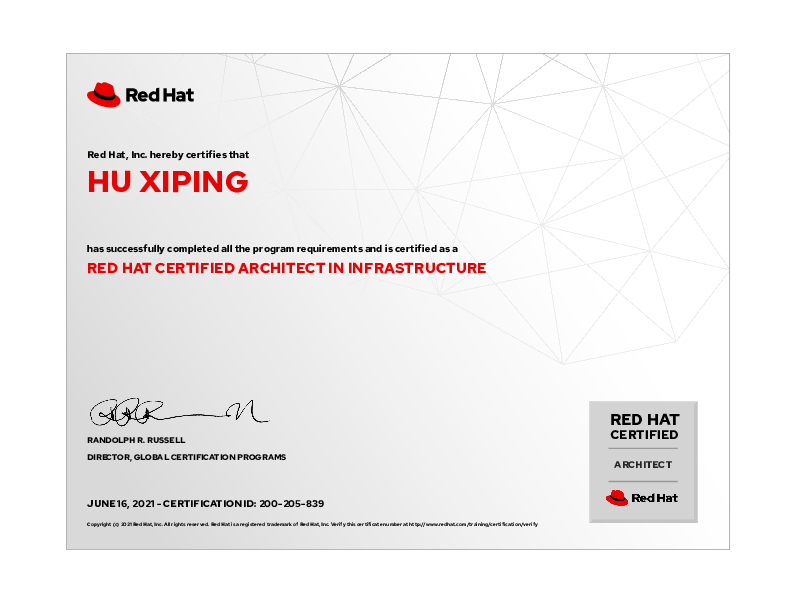
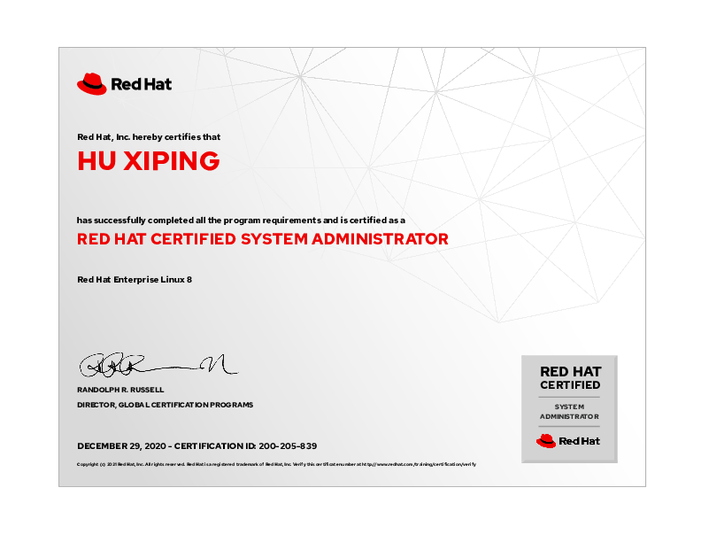
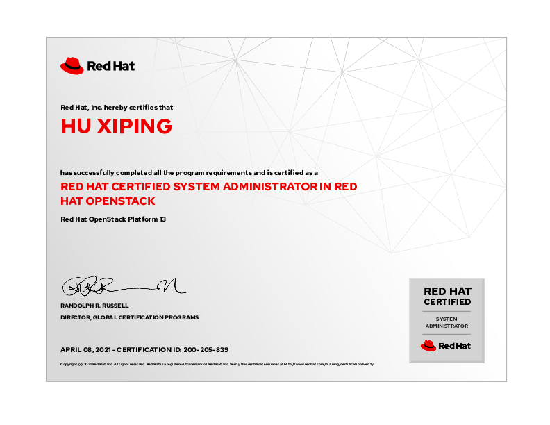
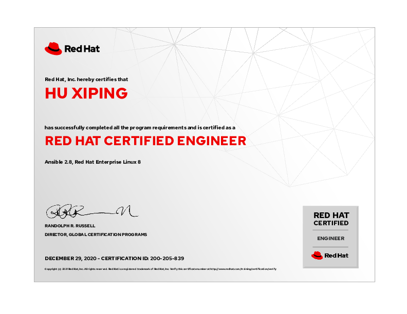
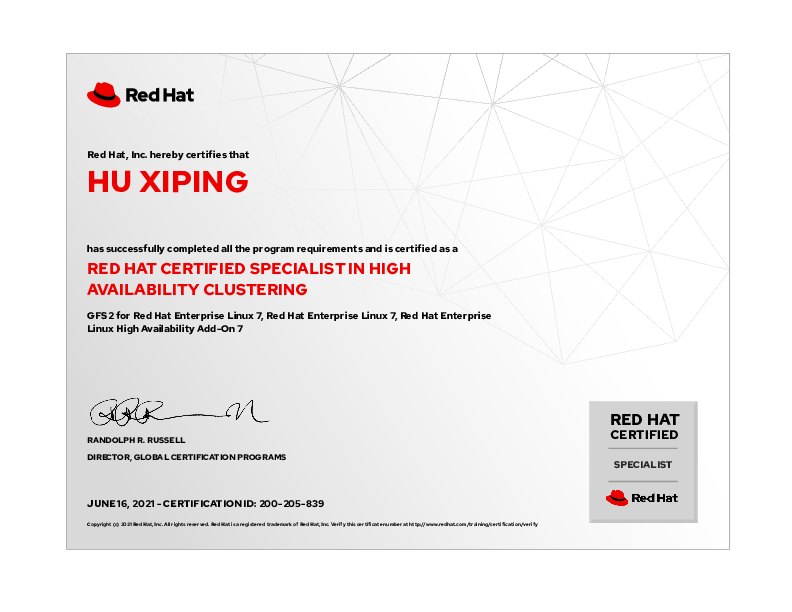
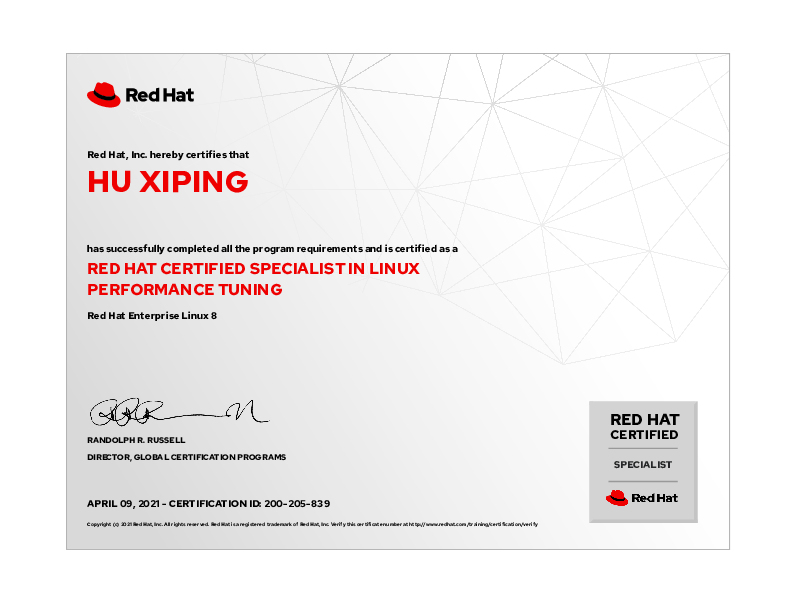

# hxp 的文档库

此网站为 [胡喜平](https://github.com/hxp-plus) 个人文档库。包含日常 Linux、存储、容器等所有技术研发的笔记。

## 个人简介

胡喜平，Linux 狂热爱好者，从 14 岁日常使用 Linux ，大学三年级获得 RedHat Linux 最高级认证 RHCA ，2 年 Arch Linux 、1 年 Gentoo 使用经验，具有丰富的 Linux 日常和企业使用经验，能通过自己折腾解决非常多的问题。

负责某国有大型银行 Ansible 及 AWX 的搭建和自动化问题、几乎所有和 Linux 沾边的事情，GPFS、Oracle、Redis、MySQL-cmha 等自动安装脚本、 Linux 故障和性能问题分析。

## 个人工作经历

### 华中科技大学 Linux 社团创始人

- 创建华中科技大学 Linux 社团，负责社团 Gentoo Linux 服务器建设。

- 和校超算中心举办讲座 <https://ncc.hust.edu.cn/info/1080/2812.htm>

### 某大型国有银行 Ansible 堡垒机和 AWX 建设

- 独自完成在银河麒麟 V10 信创系统上，搭建 4 个不同网络区域的 Kubernetes 集群，并将其作为 AWX 的容器组。将开源 AWX-23.9 使用 awx-operator 部署并自建 Keycloak 单点登陆系统、使用 SAML 对接。

- 完成 Ansible 堡垒机的容器化改造，解决不同人用相同账号上堡垒机时，每个登录之间相互隔离且有 root 权限、灰度发布等功能。

- 负责日常中间件安装、生产变更的 Ansible 脚本维护。

- 负责基于 Python 的 Ansible 模块编写。

## 个人所获得的专业认证

### RedHat 认证架构师（RHCA）

### Kubernetes CKA 认证

### RedHat 认证 Ceph 存储管理员

### RedHat 认证系统管理员

### RedHat 认证 OpenStack 系统管理员

### RedHat 认证 OpenShift 管理专家

### RedHat 认证工程师

### RedHat 认证高可用集群专家

### RedHat 认证 Linux 性能调优专家

