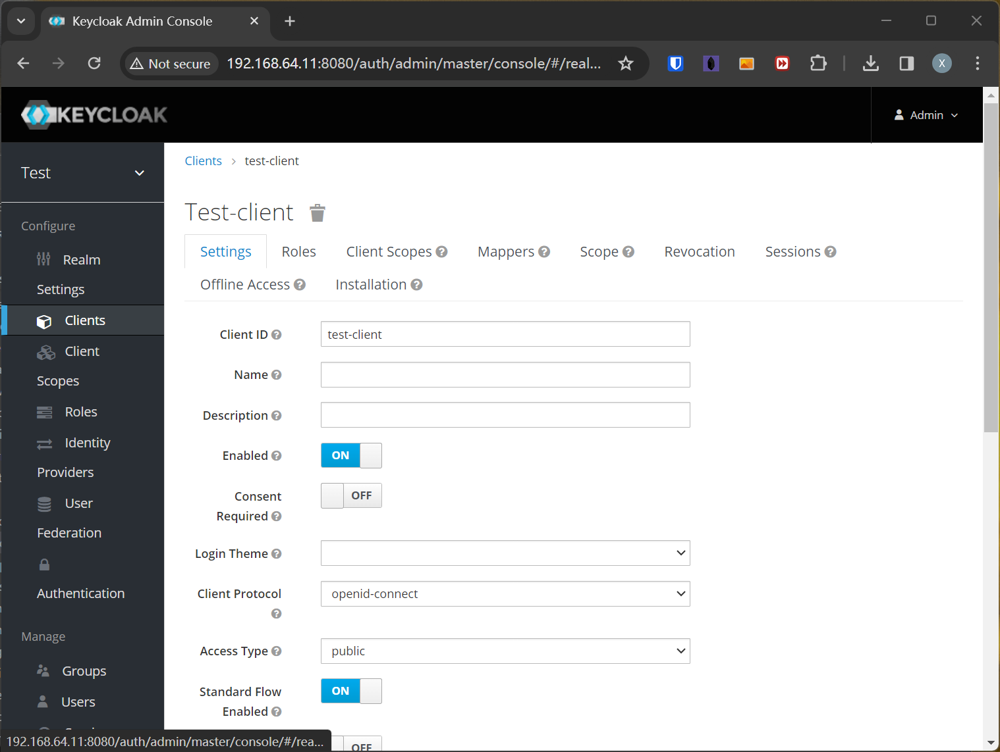
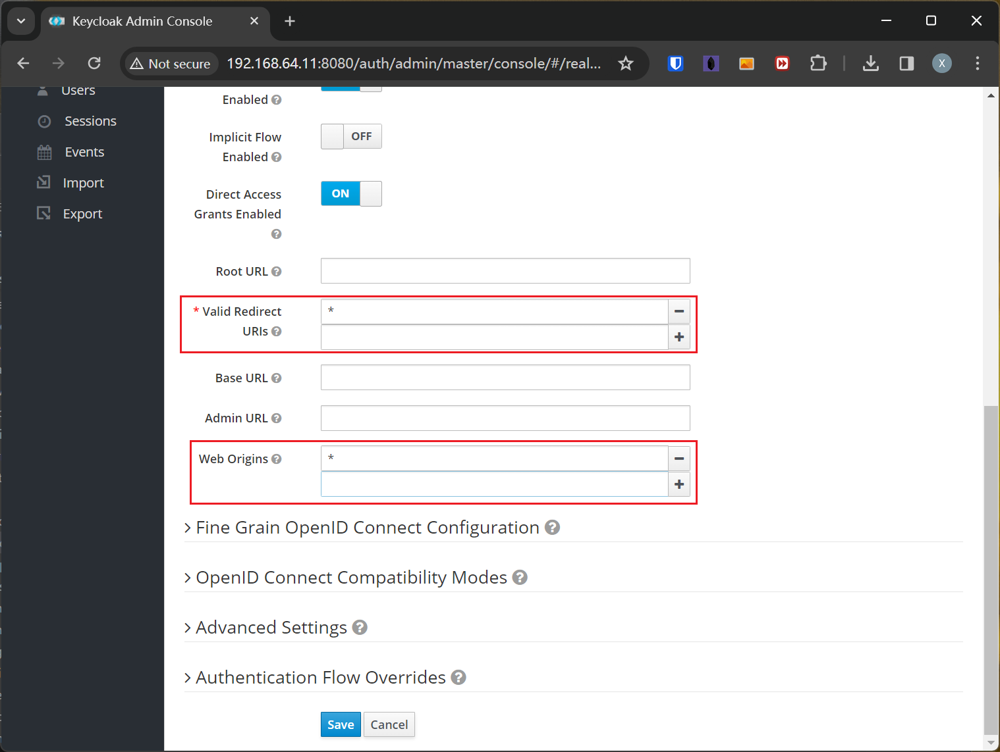
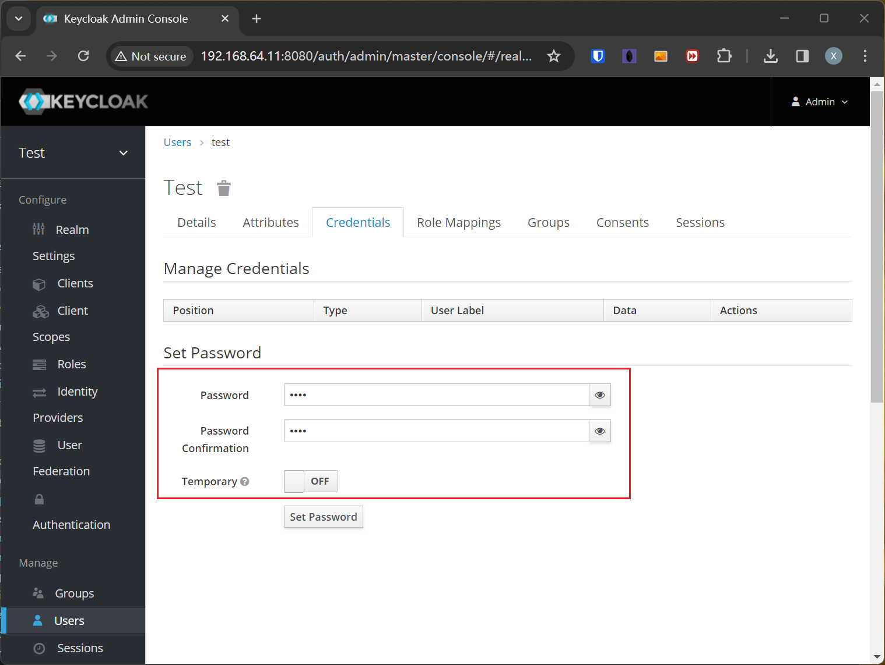
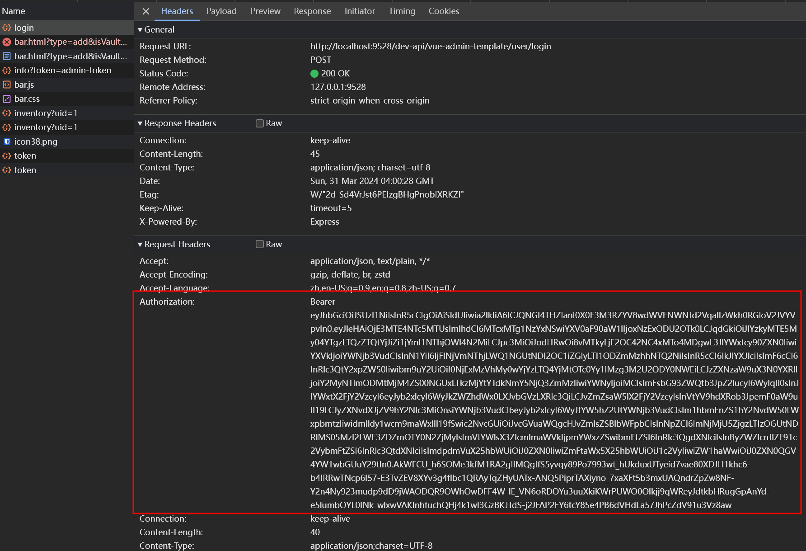

---
tags:
  - Vue3
  - Keycloak
  - 前端
---
# Vue前端接入Keycloak验证

## 搭建Keycloak服务器
本次搭建KeyClock配置如下：
- 操作系统：CentOS 8 Stream
- 软件依赖：podman-4.9.4，podman-compose-1.0.6
- IP地址：192.168.64.11
其中podman-compose需要在CentOS上启用EPEL仓库才可用yum命令安装，安装podman及podman-compose命令如下：
```bash
yum install epel-release
yum install podman podman-compose
```
创建配置文件docker-compose.yml：
```bash
version: '3.6'

services:
  keycloak_web:
    image: quay.io/keycloak/keycloak:11.0.0
    container_name: keycloak_web
    environment:
      DB_VENDOR: POSTGRES
      DB_ADDR: keycloakdb
      DB_USER: keycloak
      DB_DATABASE: keycloak
      DB_PORT: 5432
      DB_PASSWORD: password
      KC_LOG_LEVEL: info
      KEYCLOAK_ADMIN: admin
      KEYCLOAK_ADMIN_PASSWORD: admin
    commands: start-dev
    depends_on:
      - keycloakdb
    ports:
      - 8080:8080

  keycloakdb:
    image: docker.io/library/postgres:11
    volumes:
      - postgres_data:/var/lib/postgresql/data
    environment:
      POSTGRES_DB: keycloak
      POSTGRES_USER: keycloak
      POSTGRES_PASSWORD: password

volumes:
  postgres_data:
```
启动keycloak：
```bash
podman-compose up -d
```
进入容器，设置admin密码：
```bash
podman exec -it keycloak_web /bin/bash
cd /opt/jboss/keycloak/bin/
./add-user-keycloak.sh -r master -u admin -p password
```
之后访问 <http://192.168.64.11:8080/> 配置keycloak（用户名admin密码password），新建realm名称test，在Clients里配置test-client，并把`Valid Redirect URIs`和`Web Origins`修改为`*`：


新建用户test-user并设置永久有效密码：

至此keycloak配置完成
# Vue项目中加入keycloak

!!! warning "文档时效性说明"
    本文为早期笔记，可能存在版本过时、命令失效、链接失效、最佳实践变化等问题。请以官方最新文档为准。

## 下载并安装vue-Keycloak-js
```bash
npm i --save keycloak-js
```
## 修改Vue配置
Vue配置`vue.config.js`需要修改，否则会报错：
```javascript
  configureWebpack: {
    // provide the app's title in webpack's name field, so that
    // it can be accessed in index.html to inject the correct title.
    module: {
      // ...
      rules: [
        {
          test: /\.mjs$/,
          include: /node_modules/,
          type: 'javascript/auto'
        }
      ]
      // ...
    },
```
## 增加环境变量
修改`.env.development`，新增环境变量：
```
# keycloak options
VUE_APP_KEYCLOAK_OPTIONS_URL = 'http://192.168.64.11:8080/auth/'
VUE_APP_KEYCLOAK_OPTIONS_REALM = 'test'
VUE_APP_KEYCLOAK_OPTIONS_CLIENTID = 'test-client'
VUE_APP_KEYCLOAK_OPTIONS_ONLOAD = 'login-required'
```
## 在main.js中加入keycloak认证
在main.js中加入以下代码，实现token刷新和认证，token存储在localStorage中：
```javascript
import Keycloak from 'keycloak-js'
// ...
// keycloak init options
const initOptions = {
  url: process.env.VUE_APP_KEYCLOAK_OPTIONS_URL,
  realm: process.env.VUE_APP_KEYCLOAK_OPTIONS_REALM,
  clientId: process.env.VUE_APP_KEYCLOAK_OPTIONS_CLIENTID,
  onLoad: process.env.VUE_APP_KEYCLOAK_OPTIONS_ONLOAD
}

const keycloak = Keycloak(initOptions)

keycloak.init({ onLoad: initOptions.onLoad }).then(async authenticated => {
  if (!authenticated) {
    window.location.reload()
    return
  } else {
    Vue.prototype.$keycloak = keycloak
    await store.dispatch('user/keycloakLogin', keycloak.token)
    localStorage.setItem('Bearer', keycloak.token)
    console.log('Authenticated', keycloak)
  }
  setInterval(() => {
    keycloak.updateToken(70).then((refreshed) => {
      if (refreshed) {
        console.log('Token refreshed')
      } else {
        console.log('Token not refreshed, valid for ' +
          Math.round(keycloak.tokenParsed.exp + keycloak.timeSkew - new Date().getTime() / 1000) + ' seconds')
      }
    }).catch(error => {
      console.log('Failed to refresh token', error)
    })
  }, 60000)
  new Vue({
    el: '#app',
    router,
    store,
    render: h => h(App)
  })
}).catch(error => {
  console.log('Authenticated Failed', error)
})
```
同时，需要在每次请求中，都需要带上keycloak的token，例如本次项目使用的前端是[Vue-element-admin](https://panjiachen.github.io/vue-element-admin-site/zh/guide/)的基础模板[vue-element-template](https://github.com/PanJiaChen/vue-admin-template)，请求拦截器在src/utils/request.js中，需要做如下修改：
```javascript
// request interceptor
service.interceptors.request.use(
  config => {
    console.log(`Current Bearer Token: ${localStorage.getItem('Bearer')}`)
    config.headers.Authorization = `Bearer ${localStorage.getItem('Bearer')}`
    return config
  },
  error => {
    // do something with request error
    console.log(error) // for debug
    return Promise.reject(error)
  }
)
```
之后验证所有请求都带上了token：

在`src/layout/components/Navbar.vue`需要新增Keycloak登出的支持：
```javascript
    async logout() {
      await this.$store.dispatch('user/logout')
      this.$router.push(`/login?redirect=${this.$route.fullPath}`)
      await this.$store.dispatch('user/keycloakLogout')
    }
```
# 参考文献

<https://juejin.cn/post/6984325341519020040>

<https://zhuanlan.zhihu.com/p/565981971>

<https://medium.com/keycloak/secure-vue-js-app-with-keycloak-94814181e344>

<https://github.com/dsb-norge/vue-keycloak-js/issues/125>

<https://github.com/dsb-norge/vue-keycloak-js>

<https://juejin.cn/post/6844904152590450702>