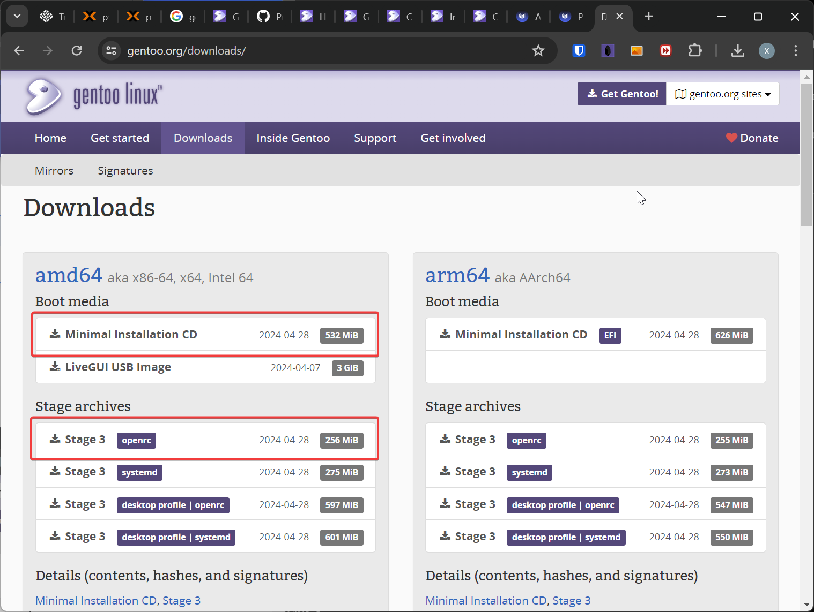

---
tags:
  - Gentoo
  - Linux
---

# 在 Hyper-V 环境安装 Gentoo

!!! note

    本次 Gentoo 安装将会安装在 UEFI 模式启动的 Hyper-V 虚拟机上，其中 init 方式选择传统的 openrc 而非 systemd 。

## 准备工作

### 下载安装介质

去 [Gentoo 下载官网](https://www.gentoo.org/downloads/) ，下载 Boot Media 和 Stage Archive：



### 发放虚拟机

发放满足如下要求的虚拟机：

- 虚拟机代数：第 2 代 （UEFI 启动）
- 磁盘大小：64GB
- CD-ROM：刚刚下载的 Boot Media ISO 文件
- Secure Boot：关闭

发放完成后，从 CD-ROM 启动并引导进入系统。

### 连接网络并启动 SSH 服务

使用静态 IP 地址的方式配置网络，使用 `ip a` 命令查询到当前环境网卡名称为 `eth0` ，之后使用命令 `net-setup eth0` 命令配置网络，一路回车即使用 DHCP 模式。之后使用 `ifconfig` 命令查看 DHCP 获得的 IP 地址。

之后使用 `passwd` 命令设置临时 root 密码，使用 `rc-service sshd start` 命令启动 SSH 服务，后续通过 SSH 远程连接来继续安装。

## 磁盘分区格式化

使用 `fdisk` 对硬盘进行分区，分区表格式为 GPT ，此次使用的分区表如下：

| 分区名称  | 分区大小         | 文件系统 | 挂载点    |
| --------- | ---------------- | -------- | --------- |
| /dev/sda1 | 1G               | ext4     | /boot     |
| /dev/sda2 | 256M             | vfat     | /boot/efi |
| /dev/sda3 | 磁盘剩余所有空间 | ext4     | /         |

格式化磁盘分区：

```
mkfs.ext4 /dev/sda1
mkfs.vfat /dev/sda2
mkfs.ext4 /dev/sda3
```

挂载文件系统：

```
mkdir --parents /mnt/gentoo
mount /dev/sda3 /mnt/gentoo
mkdir --parents /mnt/gentoo/boot
mount /dev/sda1 /mnt/gentoo/boot
mkdir --parents /mnt/gentoo/boot/efi
mount /dev/sda2 /mnt/gentoo/boot/efi
```

## 解压 stage 文件

先将 stage 文件放在家目录下，然后解压：

```
cd /mnt/gentoo/
tar xpvf ~/stage3-*.tar.xz --xattrs-include='*.*' --numeric-owner
```

## 同步时间

最好在安装前用 `chronyd` 命令同步下时间，避免日后下载东西报错：

```
chronyd -q
```

## 默认配置修改

修改 `/mnt/gentoo/etc/portage/make.conf` 中以下一行：

```
COMMON_FLAGS="-march=native -O2 -pipe"
```

修改之后编译安装所有软件会根据机器自己的指令集编译。

## 安装 base system

### 复制 DNS 服务器信息到新系统

```
cp --dereference /etc/resolv.conf /mnt/gentoo/etc/
```

### 挂载文件系统

```
mount --types proc /proc /mnt/gentoo/proc
mount --rbind /sys /mnt/gentoo/sys
mount --make-rslave /mnt/gentoo/sys
mount --rbind /dev /mnt/gentoo/dev
mount --make-rslave /mnt/gentoo/dev
mount --bind /run /mnt/gentoo/run
mount --make-slave /mnt/gentoo/run
```

### chroot 进入新系统

挂载文件系统后， chroot 进入新系统：

```
chroot /mnt/gentoo /bin/bash
```

chroot 之后需要 source 下 profile：

```
source /etc/profile
export PS1="(chroot) ${PS1}"
```

### 配置 portage

创建配置文件：

```
mkdir --parents /etc/portage/repos.conf
cp /usr/share/portage/config/repos.conf /etc/portage/repos.conf/gentoo.conf
```

为了加快下载速度，需要配置镜像，修改 `/etc/portage/repos.conf/gentoo.conf` ：

```
sync-uri = rsync://mirrors.tuna.tsinghua.edu.cn/gentoo-portage
```

在 `/etc/portage/make.conf` 中加入：

```
GENTOO_MIRRORS="https://mirrors.tuna.tsinghua.edu.cn/gentoo"
```

更新仓库：

```
emerge-webrsync
emerge --sync
```

### 更新所有软件包

```
emerge --ask --verbose --update --deep --newuse @world
```

## 本地化配置

### 设置时区

```
echo "Asia/Shanghai" > /etc/timezone
emerge --config sys-libs/timezone-data
```

### 设置 locale

在 `/etc/locale.gen` 中对需要的 locale 取消注释，然后重新生成 locale ：

```
locale-gen
```

设置默认 locale ：

```
eselect locale list
```

```
Available targets for the LANG variable:
  [1]   C
  [2]   C.utf8
  [3]   POSIX
  [4]   en_US.utf8
  [5]   C.UTF8 *
  [ ]   (free form)
```

```
eselect locale set 4
```

```
Setting LANG to en_US.utf8 ...
Run ". /etc/profile" to update the variable in your shell.
```

重新加载 profile ：

```
env-update && source /etc/profile && export PS1="(chroot) ${PS1}"
```

## 编译并安装内核

### 下载内核源码

```
emerge --ask sys-kernel/installkernel sys-kernel/gentoo-sources
```

### 选择内核源码

```
eselect kernel list
```

```
Available kernel symlink targets:
  [1]   linux-6.6.21-gentoo
```

```
eselect kernel set 1
```

### 安装 genkernel

```
mkdir -p /etc/portage/package.license
echo 'sys-kernel/linux-firmware @BINARY-REDISTRIBUTABLE' > /etc/portage/package.license/linux-firmware
emerge --ask sys-kernel/genkernel
```

### 编译内核

用 genkernel 生成并自动安装内核：

```
genkernel --mountboot --install all --hyperv
```

## 安装后配置

### 配置 fstab

编辑 `/etc/fstab`：

```
/dev/sda1 /boot ext4 defaults  0 2
/dev/sda2 /boot/efi vfat defaults 0 0
/dev/vda3 / ext4 defaults  0 0
```

### 配置主机名

```
echo gentoo > /etc/hostname
```

### 安装必要的软件

安装 dhcpcd 来为 DHCP 提供支持:

```
emerge --ask net-misc/dhcpcd
rc-update add dhcpcd default
rc-service dhcpcd start
```

安装 netifrc 来管理网络：

```
emerge --ask --noreplace net-misc/netifrc
```

安装 system logger 、 chrony 等基础软件：

```
emerge --ask app-admin/sysklogd sys-process/cronie sys-apps/mlocate net-misc/chrony app-shells/bash-completion sys-fs/xfsprogs sys-block/io-scheduler-udev-rules
rc-update add sysklogd default
rc-update add chronyd default
```

### 安装 bootloader

安装 grub 软件包：

```
echo 'GRUB_PLATFORMS="efi-64"' >> /etc/portage/make.conf
emerge --ask --verbose sys-boot/grub
```

安装 grub 到硬盘头：

```
grub-install --efi-directory=/boot/efi
```

生成 grub 启动项配置：

```
grub-mkconfig -o /boot/grub/grub.cfg
```

### 设置 root 密码

安装过程中不要忘记用 `passwd` 命令设置密码。

### 配置网络

使用 DHCP 的方式配置网络，在 `/etc/conf.d/net` 中增加网卡配置：

```
config_eth0="dhcp"
```

配置开机启动（如果是静态地址，需要禁用 dhcpcd 防止其自动获取 169.254 网关）：

```
cd /etc/init.d
ln -s net.lo net.eth0
rc-update add net.eth0 default
```

### 配置 SSH 开机启动

```
rc-update add sshd default
```

### 配置 SSH 允许 root 使用密码登录

修改 `/etc/ssh/sshd_config` ：

```
PermitRootLogin yes
```

## 安装完成并重启

退出 chroot 环境：

```
exit
```

卸载文件系统并重启：

```
umount -l /mnt/gentoo/dev{/shm,/pts,}
umount -R /mnt/gentoo
reboot
```

## 参考文献

<https://wiki.gentoo.org/wiki/Handbook:AMD64>

<https://wiki.gentoo.org/wiki/QEMU/Linux_guest#Kernel>

<https://wiki.gentoo.org/wiki/Kernel/Configuration>
