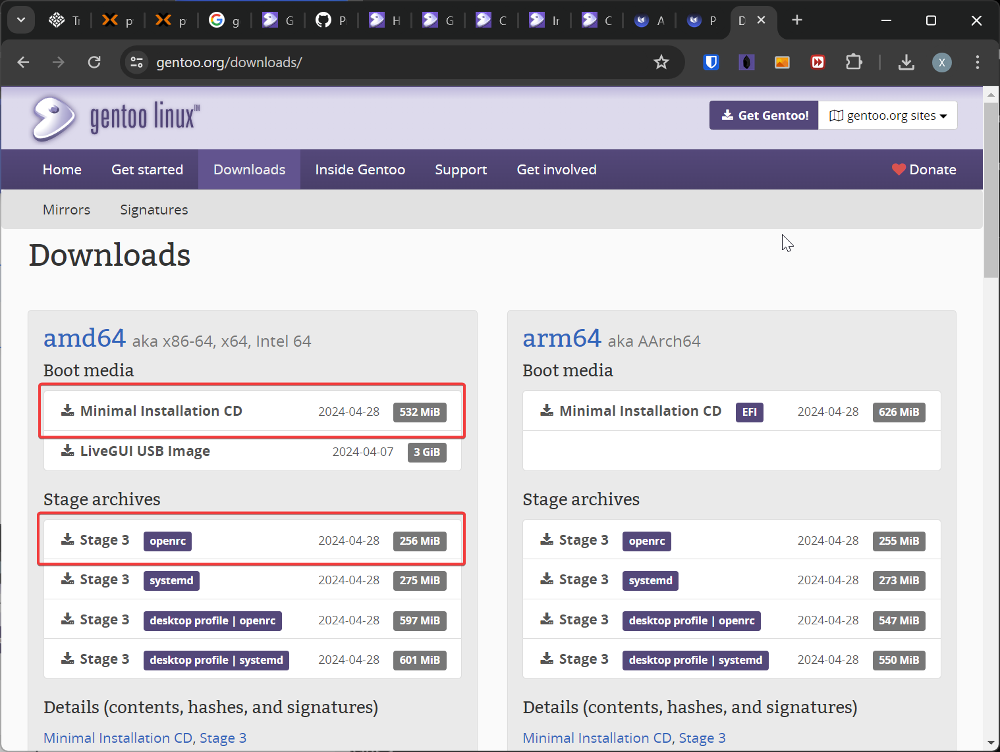

---
tags:
  - Gentoo
  - Linux
---

!!! note

    本次 Gentoo 安装将会安装在 BIOS 模式启动的 QEMU 虚拟机上，其中 init 方式选择传统的 openrc 而非 systemd 。

## 准备工作

### 下载安装介质

去 [Gentoo 下载官网](https://www.gentoo.org/downloads/) ，下载 Boot Media 和 Stage Archive：



### 发放虚拟机

发放满足如下要求的虚拟机：

- 启动方式：BIOS
- 磁盘大小：64GB
- CD-ROM：刚刚下载的 Boot Media ISO 文件
- Secure Boot：关闭
- QEMU Guest Agent：开启

发放完成后，从 CD-ROM 启动并引导进入系统。

### 连接网络并启动 SSH 服务

使用静态 IP 地址的方式配置网络，使用 `ip a` 命令查询到当前环境网卡名称为 `enp0s18` ，之后使用命令 `net-setup enp0s18` 命令配置网络，本次 IP 地址暂时配置为 `192.168.100.200` （跟着 TUI 界面指引一步步配置即可）。

!!! tip

    如果配置完成后网络不通，需要用 `ip r` 命令检查路由表是否正确，如果不正确需要添加如下路由：
    ```
    ip route add 192.168.100.0/24 dev enp0s18
    ip route add default via 192.168.100.1
    ```
    用以下命令重启网卡：
    ```
    ifconfig enp0s18 down
    ifconfig enp0s18 up
    ```

之后使用 `passwd` 命令设置临时 root 密码，使用 `rc-service sshd start` 命令启动 SSH 服务，后续通过 SSH 远程连接来继续安装。

## 磁盘分区格式化

参考 [官方手册](https://wiki.gentoo.org/wiki/Handbook:AMD64/Installation/Disks) 的 "Partitioning the disk with MBR for BIOS / legacy boot" 进行分区（不创建 swap 分区）：

```
livecd ~ # fdisk /dev/vda

Welcome to fdisk (util-linux 2.39.3).
Changes will remain in memory only, until you decide to write them.
Be careful before using the write command.

Device does not contain a recognized partition table.
Created a new DOS (MBR) disklabel with disk identifier 0x043cf7fb.

Command (m for help): o
Created a new DOS (MBR) disklabel with disk identifier 0x76a86e99.

Command (m for help): n
Partition type
   p   primary (0 primary, 0 extended, 4 free)
   e   extended (container for logical partitions)
Select (default p): p
Partition number (1-4, default 1):
First sector (2048-134217727, default 2048):
Last sector, +/-sectors or +/-size{K,M,G,T,P} (2048-134217727, default 134217727): +1G

Created a new partition 1 of type 'Linux' and of size 1 GiB.

Command (m for help): a
Selected partition 1
The bootable flag on partition 1 is enabled now.

Command (m for help): n
Partition type
   p   primary (1 primary, 0 extended, 3 free)
   e   extended (container for logical partitions)
Select (default p):

Using default response p.
Partition number (2-4, default 2):
First sector (2099200-134217727, default 2099200):
Last sector, +/-sectors or +/-size{K,M,G,T,P} (2099200-134217727, default 134217727):

Created a new partition 2 of type 'Linux' and of size 63 GiB.

Command (m for help): p
Disk /dev/vda: 64 GiB, 68719476736 bytes, 134217728 sectors
Units: sectors of 1 * 512 = 512 bytes
Sector size (logical/physical): 512 bytes / 512 bytes
I/O size (minimum/optimal): 512 bytes / 512 bytes
Disklabel type: dos
Disk identifier: 0x76a86e99

Device     Boot   Start       End   Sectors Size Id Type
/dev/vda1  *       2048   2099199   2097152   1G 83 Linux
/dev/vda2       2099200 134217727 132118528  63G 83 Linux

Command (m for help): w
The partition table has been altered.
Calling ioctl() to re-read partition table.
Syncing disks.
```

格式化并挂载文件系统：

```
mkfs.xfs /dev/vda1
mkfs.xfs /dev/vda2
mkdir --parents /mnt/gentoo
mount /dev/vda2 /mnt/gentoo
mkdir --parents /mnt/gentoo/boot
mount /dev/vda1 /mnt/gentoo/boot
```

## 解压 stage 文件

先将 stage 文件放在家目录下，然后解压：

```
cd /mnt/gentoo/
tar xpvf ~/stage3-*.tar.xz --xattrs-include='*.*' --numeric-owner
```

## 同步时间

最好在安装前用 `chronyd` 命令同步下时间，避免日后下载东西报错：

```
chronyd -q
```

## 默认配置修改

修改 /mnt/gentoo/etc/portage/make.conf` 中以下一行：

```
COMMON_FLAGS="-march=native -O2 -pipe"
```

修改之后编译安装所有软件会根据机器自己的指令集编译。

## 安装 base system

### 复制 DNS 服务器信息到新系统

```
cp --dereference /etc/resolv.conf /mnt/gentoo/etc/
```

### 挂载文件系统

```
mount --types proc /proc /mnt/gentoo/proc
mount --rbind /sys /mnt/gentoo/sys
mount --make-rslave /mnt/gentoo/sys
mount --rbind /dev /mnt/gentoo/dev
mount --make-rslave /mnt/gentoo/dev
mount --bind /run /mnt/gentoo/run
mount --make-slave /mnt/gentoo/run
```

### chroot 进入新系统

挂载文件系统后， chroot 进入新系统：

```
chroot /mnt/gentoo /bin/bash
```

chroot 之后需要 source 下 profile：

```
source /etc/profile
export PS1="(chroot) ${PS1}"
```

### 配置 portage

创建配置文件：

```
mkdir --parents /etc/portage/repos.conf
cp /usr/share/portage/config/repos.conf /etc/portage/repos.conf/gentoo.conf
```

为了加快下载速度，需要配置镜像，修改 `/etc/portage/repos.conf/gentoo.conf` ：

```
sync-uri = rsync://mirrors.tuna.tsinghua.edu.cn/gentoo-portage
```

在 `/etc/portage/make.conf` 中加入：

```
GENTOO_MIRRORS="https://mirrors.tuna.tsinghua.edu.cn/gentoo"
```

更新仓库：

```
emerge-webrsync
emerge --sync
```

### 更新所有软件包

```
emerge --ask --verbose --update --deep --newuse @world
```

## 本地化配置

### 设置时区

```
echo "Asia/Shanghai" > /etc/timezone
emerge --config sys-libs/timezone-data
```

### 设置 locale

在 `/etc/locale.gen` 中对需要的 locale 曲线注释，然后重新生成 locale ：

```
locale-gen
```

设置默认 locale ：

```
eselect locale list
```

```
Available targets for the LANG variable:
  [1]   C
  [2]   C.utf8
  [3]   POSIX
  [4]   en_US.utf8
  [5]   C.UTF8 *
  [ ]   (free form)
```

```
eselect locale set 4
```

```
Setting LANG to en_US.utf8 ...
Run ". /etc/profile" to update the variable in your shell.
```

重新加载 profile ：

```
env-update && source /etc/profile && export PS1="(chroot) ${PS1}"
```

## 编译并安装内核

### 下载内核源码

```
emerge --ask sys-kernel/installkernel sys-kernel/gentoo-sources
```

### 选择内核源码

```
eselect kernel list
```

```
Available kernel symlink targets:
  [1]   linux-6.6.21-gentoo
```

```
eselect kernel set 1
```

### 安装 genkernel

```
mkdir -p /etc/portage/package.license
echo 'sys-kernel/linux-firmware @BINARY-REDISTRIBUTABLE' > /etc/portage/package.license/linux-firmware
emerge --ask sys-kernel/genkernel
```

### 编译内核

用 genkernel 生成并自动安装内核：

```
genkernel --mountboot --install all --menuconfig
```

注意，在弹出的界面中，需要额外配置这几项来将相关驱动编译进内核：

```
Processor type and features  --->
    [*] Linux guest support --->
        [*] Enable Paravirtualization code
        [*] KVM Guest support (including kvmclock)
Device Drivers  --->
    [*] Virtio drivers  --->
        <*> PCI driver for virtio devices
    [*] Block devices  --->
        <*> Virtio block driver
    SCSI device support  --->
        [*] SCSI low-level drivers  --->
            [*] virtio-scsi support
    [*] Network device support  --->
        [*] Network core driver support
            <*> Virtio network driver
    Graphics support  --->
        <*> Direct Rendering Manager (XFree86 4.1.0 and higher DRI support)  --->
        <*> Virtio GPU driver
    Character devices --->
       <*> Hardware Random Number Generator Core support --->
           <*> VirtIO Random Number Generator support
       <*> Virtio console
```

### 安装 QEMU 虚拟机相关软件

```
emerge --ask sys-power/acpid app-emulation/qemu-guest-agent
rc-update add acpid default
rc-update add qemu-guest-agent default
```

## 安装后配置

### 配置 fstab

编辑 `/etc/fstab`：

```
/dev/vda1 /boot xfs defaults  0 2
/dev/vda2 / xfs defaults  0 0
```

### 配置主机名

```
echo gentoo > /etc/hostname
```

### 安装必要的软件

安装 dhcpcd 来为 DHCP 提供支持:

```
emerge --ask net-misc/dhcpcd
rc-update add dhcpcd default
rc-service dhcpcd start
```

安装 netifrc 来管理网络：

```
emerge --ask --noreplace net-misc/netifrc
```

安装 system logger 、 chrony 等基础软件：

```
emerge --ask app-admin/sysklogd sys-process/cronie sys-apps/mlocate net-misc/chrony app-shells/bash-completion sys-fs/xfsprogs sys-block/io-scheduler-udev-rules
rc-update add sysklogd default
rc-update add chronyd default
```

### 安装 bootloader

安装 grub 软件包：

```
echo 'GRUB_PLATFORMS="pc"' >> /etc/portage/make.conf
emerge --ask --verbose sys-boot/grub
```

配置 grub ，修改 `/etc/default/grub` ：

```
GRUB_CMDLINE_LINUX="console=tty0 console=ttyS0"
GRUB_TERMINAL=console
```

配置 `/etc/inittab` ：

```
# SERIAL CONSOLES
s0:12345:respawn:/sbin/agetty -L 115200 ttyS0 vt100
```

安装 grub 到硬盘头：

```
grub-install /dev/vda
```

生成 grub 启动项配置：

```
grub-mkconfig -o /boot/grub/grub.cfg
```

### 设置 root 密码

安装过程中不要忘记用 `passwd` 命令设置密码。

### 配置网络

!!! note

    部分安装场景下网卡 `enp0s18` 在进入新系统后会变成 `ens18` ，需要进行相应调整。

使用静态地址的方式配置网络，在 `/etc/conf.d/net` 中增加网卡配置：

```
config_enp0s18="192.168.100.5 netmask 255.255.255.0 brd 192.168.100.255"
routes_enp0s18="default via 192.168.100.1"
```

配置开机启动（如果是静态地址，需要禁用 dhcpcd 防止其自动获取 169.254 网关）：

```
cd /etc/init.d
ln -s net.lo net.enp0s18
rc-update del dhcpcd
rc-update add net.enp0s18 default
```

### 配置 SSH 开机启动

```
rc-update add sshd default
```

## 安装完成并重启

```
exit
umount -l /mnt/gentoo/dev{/shm,/pts,}
umount -R /mnt/gentoo
reboot
```

## 参考文献

<https://wiki.gentoo.org/wiki/Handbook:AMD64>

<https://wiki.gentoo.org/wiki/QEMU/Linux_guest#Kernel>

<https://wiki.gentoo.org/wiki/Kernel/Configuration>
