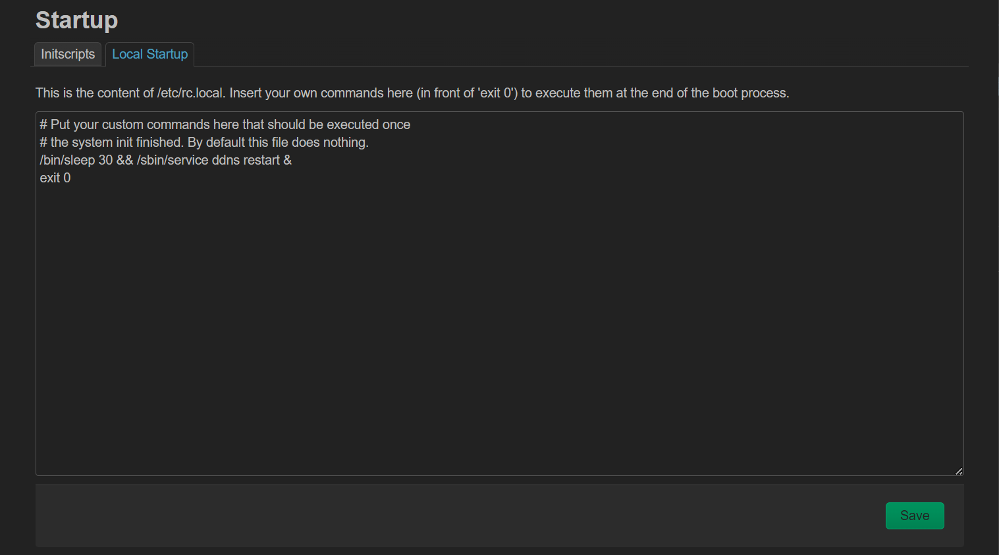

---
tags:
  - OpenWrt
  - DDNS
---

# OpenWrt DDNS 开机启动失败问题

## 问题描述

OpenWrt 在安装 `luci-app-ddns` 和 `ddns-scripts-dnspod` 后，每次开机后均不能正常启动。在 `System -> Startup -> Initscripts` 里显示 `ddns` 是 `Enabled` 状态，且点击 `Restart` 能正常启动。

## 解决方法

已知 bug ，可以添加额外启动脚本解决，在 `System -> Startup -> Local Startup` 添加：

```bash
/bin/sleep 30 && /sbin/service ddns restart &
```

添加后如图：



## 参考资料

https://forum.openwrt.org/t/ddns-do-not-start-when-reboot/98374/17

https://forum.openwrt.org/t/ddns-do-not-start-when-reboot/98374/2

https://forum.openwrt.org/t/ddns-do-not-start-when-reboot/98374/2

https://forum.openwrt.org/t/ddns-auto-start-not-working/30866
