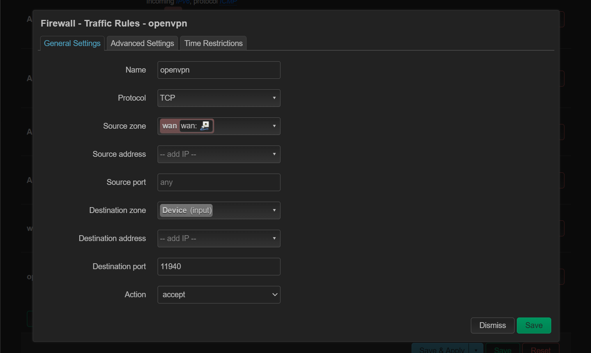
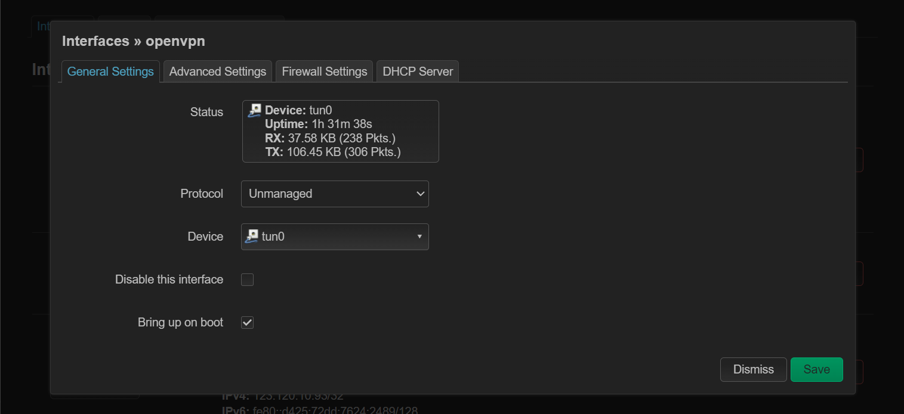
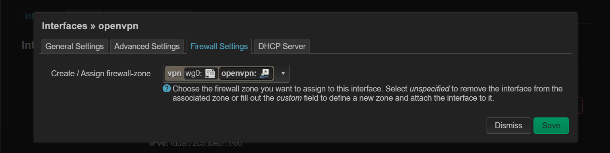
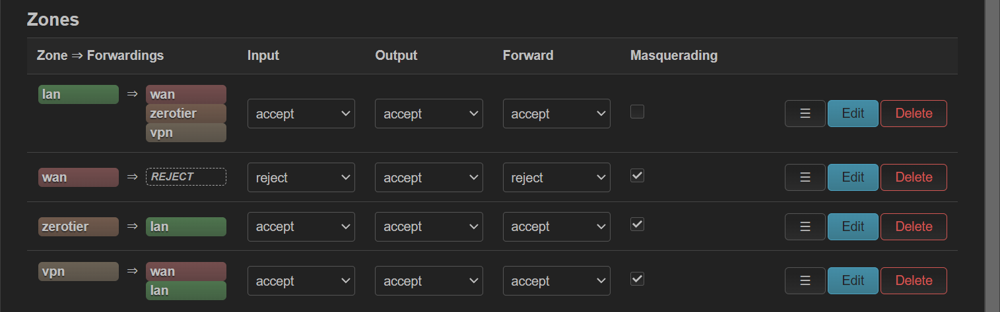
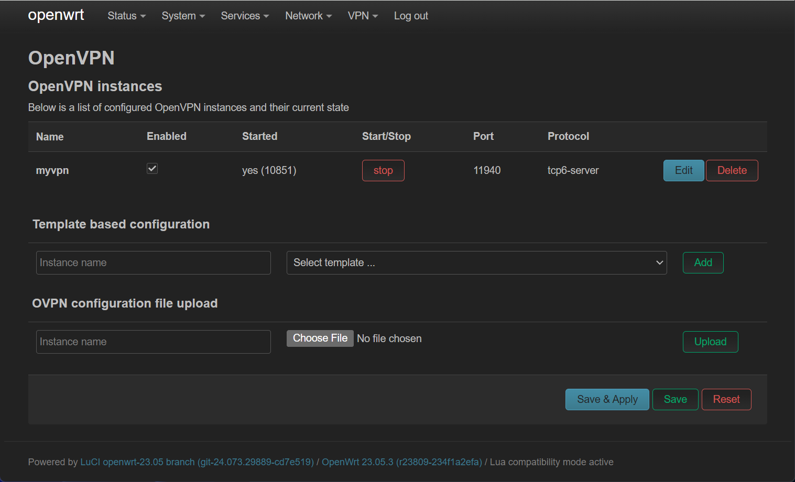
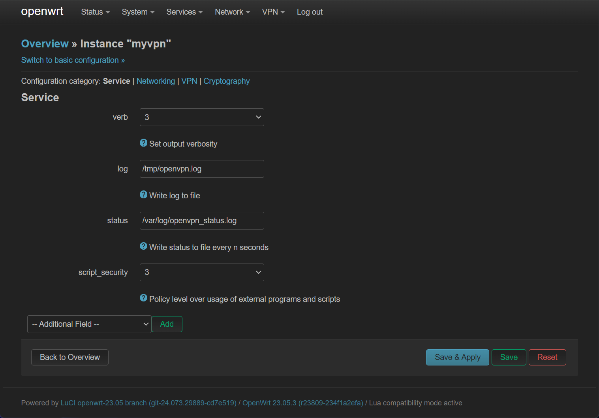
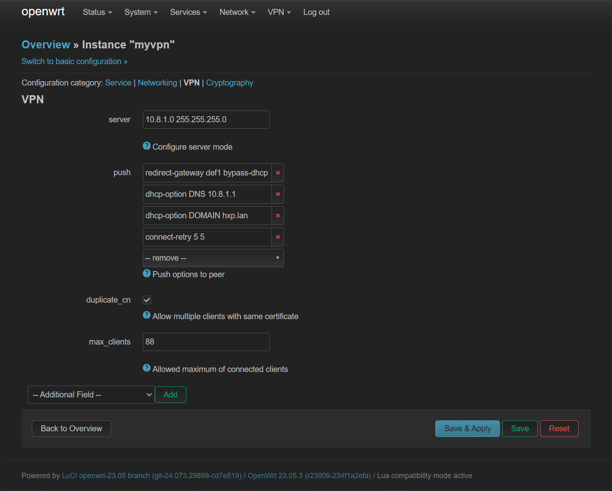
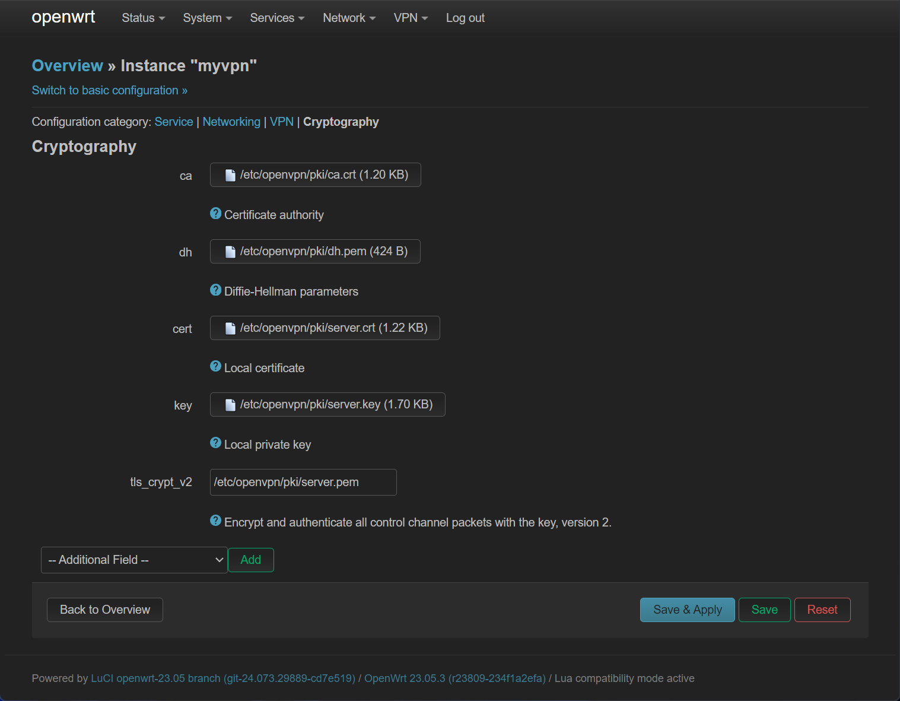

---
tags:
  - OpenWrt
  - OpenVPN
---

# OpenWrt 安装 OpenVPN

## 前言

尽管 OpenVPN 这种异地组网方式有些许远古，但是还是有使用 OpenVPN 的必要，譬如说它支持 TCP 协议。因此本文会建立一个 OpenVPN 服务器，前置条件如下：

- OpenWrt 有公网 IPv6 ，且高位 TCP 端口可稳定连接。
- 私网网段 10.8.1.0/24 没有被使用，将会被作为 OpenVPN 私网网段。

## 安装软件包

使用 opkg 安装软件：

```
# Install packages
opkg update
opkg install openvpn-openssl openvpn-easy-rsa
```

## 设置环境变量

以下为安装需要的环境变量：

```bash
# Configuration parameters
VPN_DIR="/etc/openvpn"
VPN_PKI="/etc/easy-rsa/pki"
VPN_PORT="11940"
VPN_PROTO="tcp6"
VPN_POOL="10.8.1.0 255.255.255.0"
VPN_DNS="${VPN_POOL%.* *}.1"
VPN_DN="$(uci -q get dhcp.@dnsmasq[0].domain)"

# Fetch server address
NET_FQDN="$(uci -q get ddns.@service[0].lookup_host)"
. /lib/functions/network.sh
network_flush_cache
network_find_wan NET_IF
network_get_ipaddr NET_ADDR "${NET_IF}"
if [ -n "${NET_FQDN}" ];then
  VPN_SERV="${NET_FQDN}"
else
  VPN_SERV="${NET_ADDR}"
fi
```

如果中途退出，需要重新设置。

## 使用 EasyRSA 生成密钥

一键下载并生成密钥：

```bash
cd ~
# Work around EasyRSA issues
wget -U "" -O /tmp/easyrsa.tar.gz https://github.com/OpenVPN/easy-rsa/releases/download/v3.2.0/EasyRSA-3.2.0.tgz
tar -z -x -f /tmp/easyrsa.tar.gz

# Configuration parameters
cat << EOF > /etc/profile.d/easy-rsa.sh
export EASYRSA_PKI="${VPN_PKI}"
export EASYRSA_TEMP_DIR="/tmp"
export EASYRSA_CERT_EXPIRE="3650"
export EASYRSA_BATCH="1"
alias easyrsa="/root/EasyRSA-3.2.0/easyrsa"
EOF
. /etc/profile.d/easy-rsa.sh

# Remove and re-initialize PKI directory
easyrsa init-pki

# Generate DH parameters
easyrsa gen-dh

# Create a new CA
easyrsa build-ca nopass

# Generate server keys and certificate
easyrsa build-server-full server nopass
openvpn --genkey tls-crypt-v2-server ${EASYRSA_PKI}/private/server.pem

# Generate client keys and certificate
easyrsa build-client-full client nopass
openvpn --tls-crypt-v2 ${EASYRSA_PKI}/private/server.pem \
--genkey tls-crypt-v2-client ${EASYRSA_PKI}/private/client.pem
```

## 生成 OpenVPN 配置并启动服务

生成客户端与服务器配置文件：

```bash
# Configure VPN service and generate client profiles
umask go=
VPN_DH="$(cat ${VPN_PKI}/dh.pem)"
VPN_CA="$(openssl x509 -in ${VPN_PKI}/ca.crt)"
ls ${VPN_PKI}/issued \
| sed -e "s/\.\w*$//" \
| while read -r VPN_ID
do
VPN_TC="$(cat ${VPN_PKI}/private/${VPN_ID}.pem)"
VPN_KEY="$(cat ${VPN_PKI}/private/${VPN_ID}.key)"
VPN_CERT="$(openssl x509 -in ${VPN_PKI}/issued/${VPN_ID}.crt)"
VPN_EKU="$(echo "${VPN_CERT}" | openssl x509 -noout -purpose)"
case ${VPN_EKU} in
(*"SSL server : Yes"*)
VPN_CONF="${VPN_DIR}/${VPN_ID}.conf"
cat << EOF > ${VPN_CONF} ;;
user nobody
group nogroup
dev tun
port ${VPN_PORT}
proto ${VPN_PROTO}
server ${VPN_POOL}
topology subnet
client-to-client
keepalive 10 60
persist-tun
persist-key
push "dhcp-option DNS ${VPN_DNS}"
push "dhcp-option DOMAIN ${VPN_DN}"
push "redirect-gateway def1"
push "persist-tun"
push "persist-key"
<dh>
${VPN_DH}
</dh>
EOF
(*"SSL client : Yes"*)
VPN_CONF="${VPN_DIR}/${VPN_ID}.ovpn"
cat << EOF > ${VPN_CONF} ;;
user nobody
group nogroup
dev tun
nobind
client
remote ${VPN_SERV} ${VPN_PORT} ${VPN_PROTO}
auth-nocache
comp-lzo yes
allow-compression yes
remote-cert-tls server
EOF
esac
cat << EOF >> ${VPN_CONF}
<tls-crypt-v2>
${VPN_TC}
</tls-crypt-v2>
<key>
${VPN_KEY}
</key>
<cert>
${VPN_CERT}
</cert>
<ca>
${VPN_CA}
</ca>
EOF
done
service openvpn restart
ls ${VPN_DIR}/*.ovpn
```

生成的客户端配置在 `/etc/openvpn/client.ovpn` ，服务器配置在 `/etc/openvpn/server.conf`

## 配置防火墙

在 `Network -> Firewall -> Traffic Rules` 配置防火墙，放行 OpenVPN 端口：



在 `Network -> Interfaces` 中添加 `tun0` 网络接口：



将该网络接口放入 `vpn` 防火墙区域：



同时，在 `Network -> Firewall -> Zones` 中，设置 `vpn` 区域对所有区域可转发，开启 `Masquerading` ，Input 、 Output 、 Forward 全部 Accept ：



至此一个最基本的 OpenVPN 配置完成。

## luci-app-openvpn 的配置

如果要使用图形化管理 OpenVPN ，首先需要安装 luci-app-openvpn ，之后根据 `/etc/openvpn/server.conf` 进行配置文件迁移。首先先在 `/etc/openvpn/server.conf` 中提取证书，并存放到相应位置：

| `server.conf` 中证书 | 存放地点                    |
| -------------------- | --------------------------- |
| ca                   | /etc/openvpn/pki/ca.crt     |
| dh                   | /etc/openvpn/pki/dh.pem     |
| cert                 | /etc/openvpn/pki/server.crt |
| key                  | /etc/openvpn/pki/server.key |
| tls-crypt-v2         | /etc/openvpn/pki/server.pem |

之后将 `/etc/openvpn/server.conf` 重命名为 `server.conf.bak` ，开始在 `VPN -> OpenVPN` 界面点击 `Edit` 对默认的 `myvpn` 进行配置：



实测最终的配置如下：









## 参考资料

https://openwrt.org/docs/guide-user/services/vpn/openvpn/server
