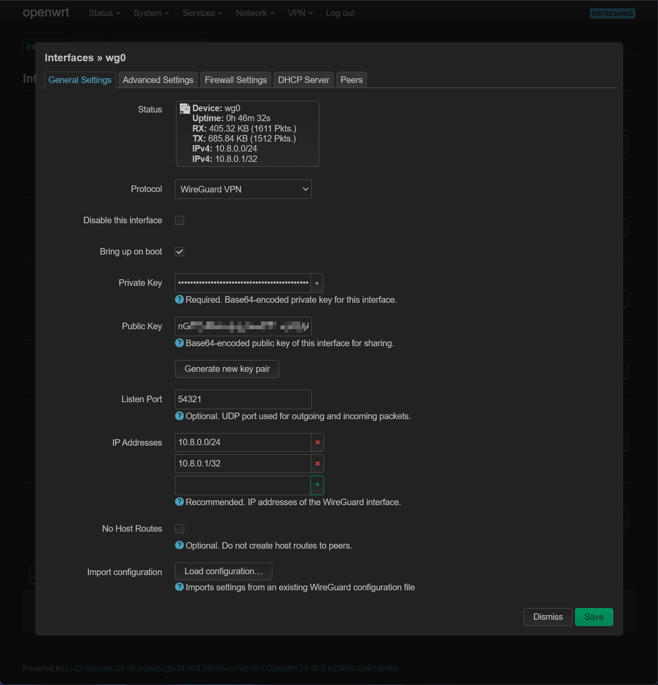
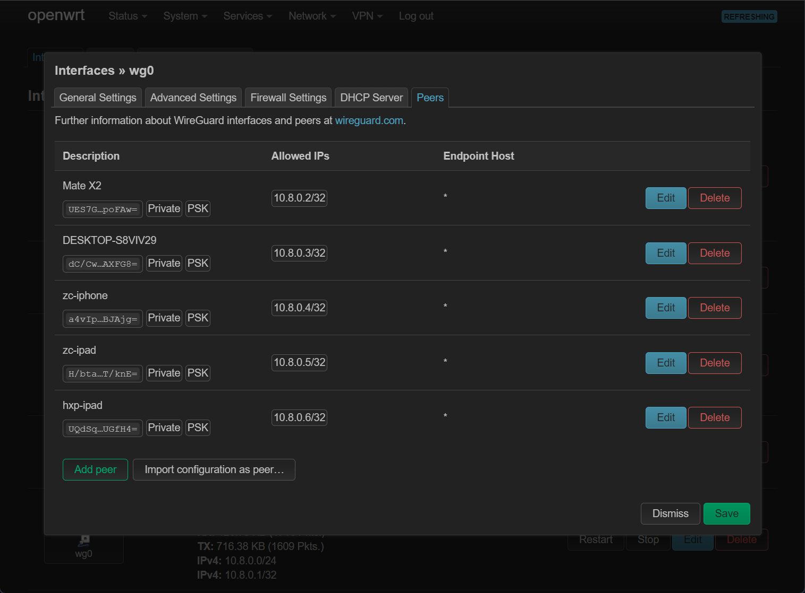
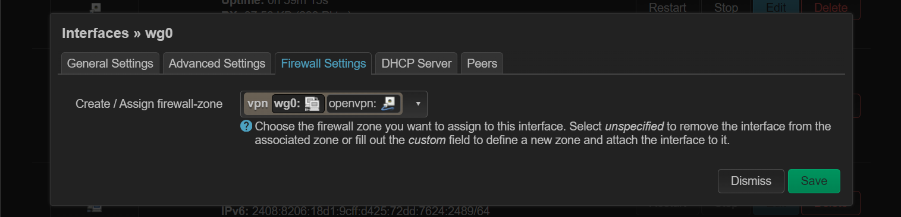
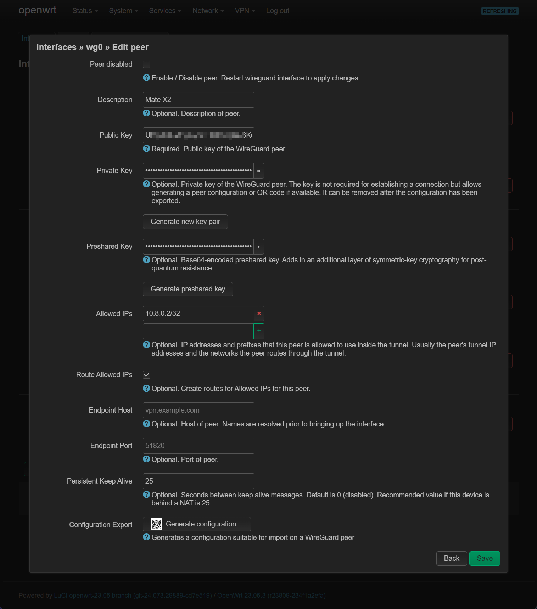
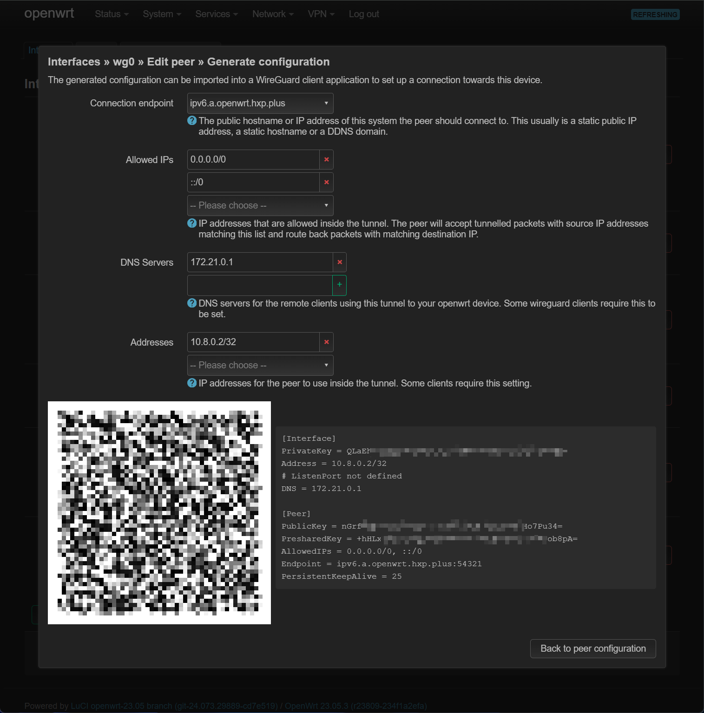
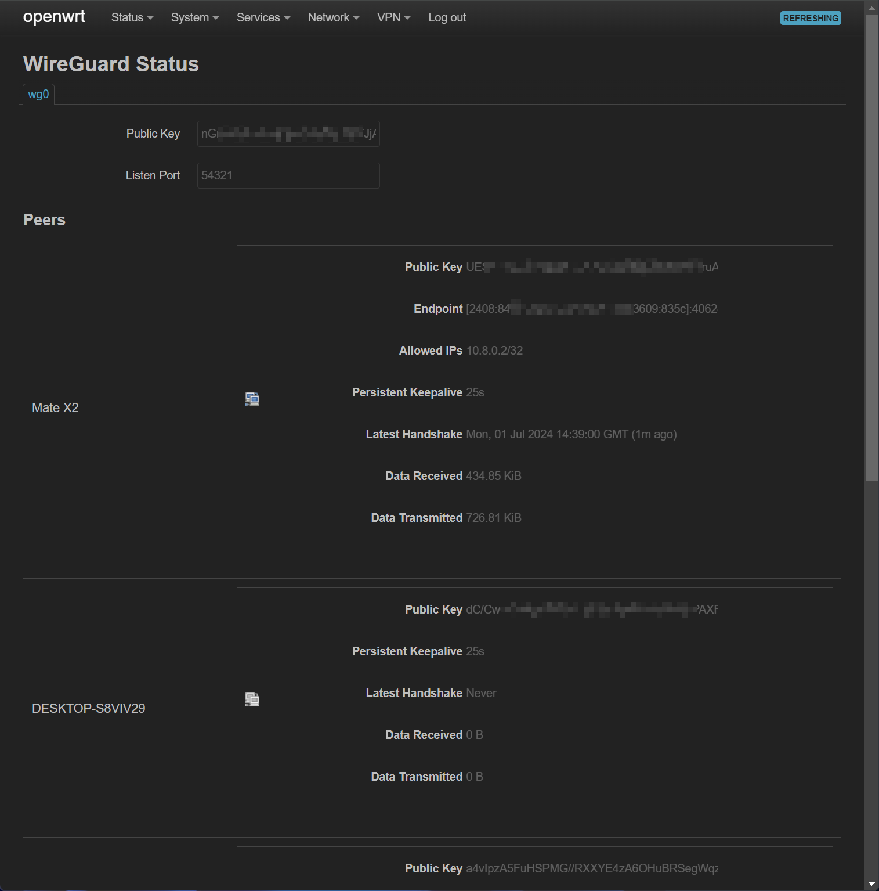
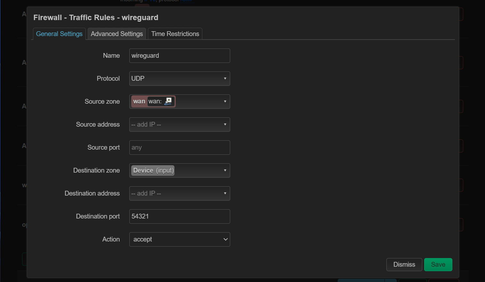
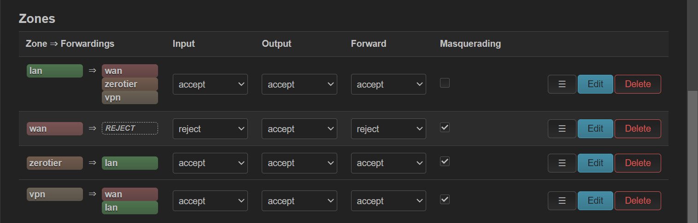

---
tags:
  - OpenWrt
  - WireGuard
---

# OpenWrt 安装 WireGuard

## 前言

当出门在外需要访问家里的服务时，总是需要一种异地组网方案。现行的异地组网方案大致有 ZeroTier 、 OpenVPN 和 WireGuard 三种，其中各有优劣。 OpenVPN 的优势是使用 TCP 连接，不容易像剩下两种方案似的有 UDP 连接不稳定的情况，缺点是速度慢。而 WireGuard 正好和 OpenVPN 相反，速度最快，但只能使用 UDP 直连。 ZeroTier 介于两种之间（它在连接非常不稳定时会使用 TCP 并走中转服务器）。

因此本文在 OpenWrt 上搭建一个 WireGuard 服务器，其中需要准备的条件如下：

- OpenWrt 系统已安装。
- 有公网 IPv6 。
- 公网 IPv6 高位 UDP 端口可以稳定连接。
- 私网网段 10.8.0.0/24 没有被使用，将会被作为 WireGuard 私网网段。

## 安装必要的软件包

安装以下软件：

- wireguard-tools
- luci-app-wireguard
- luci-proto-wireguard
- qrencode

可以去 `System -> Software` 界面安装，或者使用命令行安装。安装以后记得重启。

## 配置 WireGuard 网卡

在 `Network -> Interfaces` 界面，点击 `Add new Interface` ，添加类型为 WireGuard 的网卡：

需要点击 `Generate new key pair` 生成密钥，其中 `IP Address` 里应该填写 OpenWrt 准备使用的私网 IP 地址（10.8.0.1/32），以及整个 WireGuard 网络的地址（10.8.0.0/24）：

在 `Firewall Settings` 里，新建防火墙区域 `vpn` 并将其加入该区域：

在 `Peers` 里，设置需要连接到此 WireGuard 服务器的客户端，点击 `Add peer` 添加客户端：

同样需要点击 `Generate new key pair` 和 `Generate preshared key` 来生成 2 个密钥，勾选 `Route Allowed IPs` 并在 `Allowed IPs` 中填入客户端在 WireGuard 私网的 IP 地址（10.8.0.2/32）， `Persistens Keep Alive` 填写建议值 `25` ，之后点击 `Generate configuration` 获取客户端连接配置：

之后保存所有设置，并重启 WireGuard 网卡（每次修改后都需要重启网卡生效）。

## 查看 WireGuard 配置

在 `Status -> WireGuard` 中可以查看 WireGuard 所有客户端的信息：

## 配置防火墙

在 `Network -> Firewall -> Traffic Rules` 中，添加防火墙规则，放行 WireGuard 的端口：

同时，在 `Network -> Firewall -> Zones` 中，设置 `vpn` 区域对所有区域可转发，开启 `Masquerading` ，Input 、 Output 、 Forward 全部 Accept ：

## 使用客户端测试

移动端使用二维码，桌面端直接复制配置文件导入，进行测试。

## 参考资料

https://upsangel.com/security/vpn/%E4%B8%80%E9%8D%B5%E9%80%A3%E5%9B%9E%E5%AE%B6%E9%87%8C%E5%85%A7%E7%B6%B2%EF%BC%9Aopenwrt%E4%B8%8A%E9%83%A8%E7%BD%B2wireguard-vpn%E6%9C%8D%E5%8B%99%E5%99%A8%E7%9A%84%E4%B8%89%E5%80%8B%E8%A6%81%E9%BB%9E/
