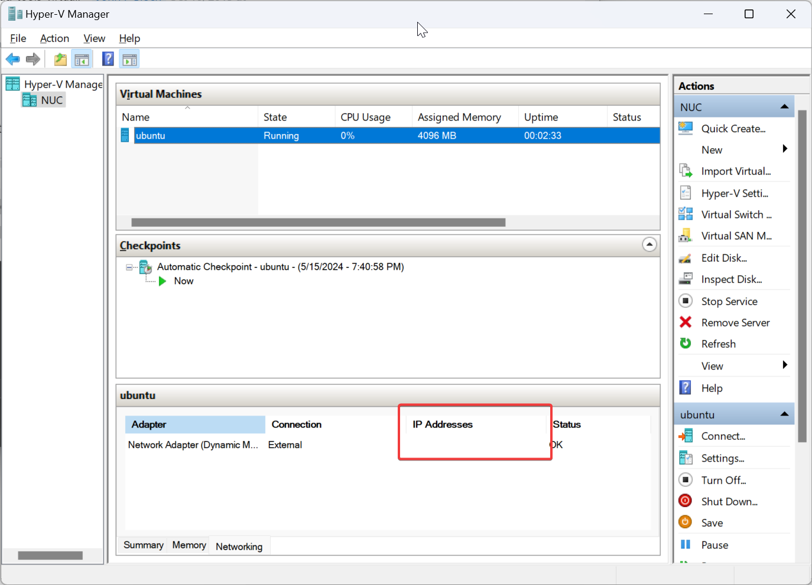

---
tags:
  - Ubuntu
  - Linux
  - Hyper-V
---

# Ubuntu 安装 Hyper-V 工具

在 Hyper-V 上默认安装好的 Ubuntu Server 后，如果虚拟机使用的 IP 地址不是 Hyper-V 分配，这里不显示：



解决方法：

```
sudo apt-get install "linux-cloud-tools-$(uname -r)"
```

这样就能安装 Hyper-V 的相关服务（需重启生效）。
