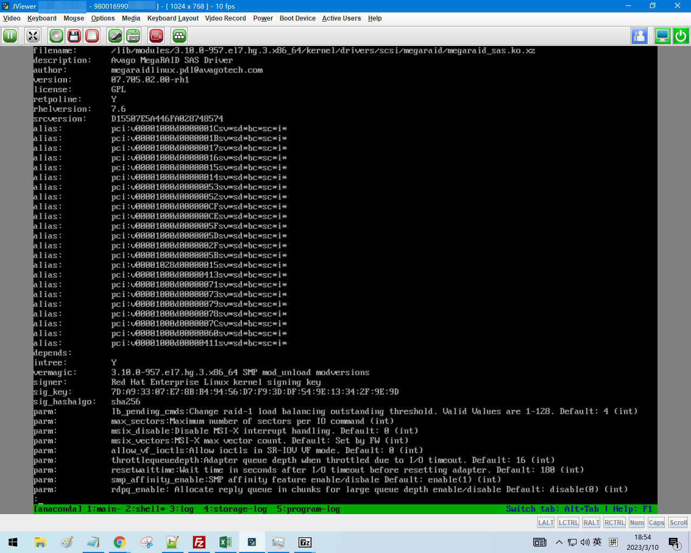
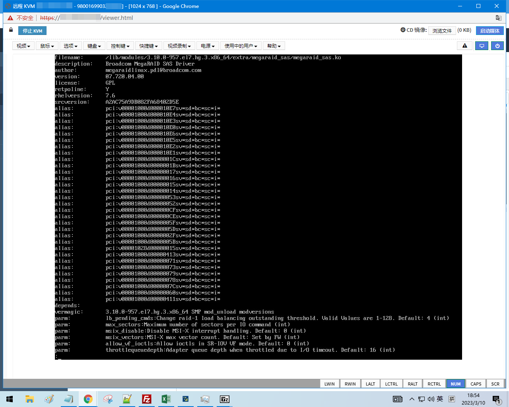

---
tags:
  - 中标麒麟
  - Linux
---

# 曙光服务器装机无 RAID 卡驱动导致不能识别硬盘问题分析与解决方案

## 问题的初步定位

2022 年曙光服务器装机时找不到硬盘，但是老的曙光服务器可以找到硬盘，之前的解决方法是挂载一个 DUD（Driver Update Disk）光盘的 ISO 镜像，DUD 盘里有 RAID 卡驱动（rpm 包形式的驱动），安装时检测到 DUD 盘现场安装驱动，并在装新系统时也安装 DUD 盘内的驱动。

这是命令 modinfo megaraid_sas 在装机不挂 DUD 镜像时的输出，可以看出 magaraid_sas 驱动的版本比较低，驱动厂商为 Avago：



这个是装好的服务器的 megaraid_sas 驱动的信息，驱动版本高，而且厂商为 Boardcom（Avago 收购 Boardcom 后改了公司的名字为 Boardcom，因此 Boradcom 和 Avago 是一个公司）：



因此，新版曙光服务器找不到驱动的原因为：新版曙光服务器升级了 RAID 卡到新的版本，但是麒麟 7.6 的安装镜像里的驱动是老版本驱动。解决方案是升级安装镜像里的 megaraid_sas 驱动程序。

同时，观察没有挂载 DUD 盘时，安装光盘里的 Linux 可以正常启动，可以加载内核和 initramfs ，initramfs 可以挂载 squashfs，从而把镜像内的操作系统启动起来。但是镜像内操作系统启动完成后，megaraid_sas 驱动程序版本低，无法驱动高版本的 RAID 卡。因此需要升级的是 squashfs 内的 RAID 卡驱动。

## 修改装机镜像中 squashfs 并加入新版驱动

!!! info

    以下过程需要用 root 用户操作

squashfs 位于安装光盘的 LiveOS 目录下，先把它移动出来：

```
mkdir /root/squashfs-edit
mv LiveOS/squashfs.img /root/squashfs-edit/
cd /root/squashfs-edit/
```

解压 squashfs：

```
unsquashfs squashfs.img
```

```
Parallel unsquashfs: Using 8 processors
1 inodes (16384 blocks) to write

[============================================================-] 16384/16384 100%

created 1 files
created 2 directories
created 0 symlinks
created 0 devices
created 0 fifos
```

解压完成后的目录结构为：

```
tree .
```

```
.
├── squashfs.img
└── squashfs-root
    └── LiveOS
        └── rootfs.img

2 directories, 2 files
```

发现 rootfs.img 是一个 ext4 文件系统：

```
file squashfs-root/LiveOS/rootfs.img
```

```
squashfs-root/LiveOS/rootfs.img: Linux rev 1.0 ext4 filesystem data, UUID=921b7a3a-746d-405e-af58-cb96cb700222, volume name "Anaconda" (extents) (64bit) (huge files)
```

将这个 rootfs.img 上传到安装了海光版本的麒麟 7.6 系统的机器上（可以是办公电脑开的 KVM 虚拟机），并挂载：

```
mkdir /root/rootfs
mount rootfs.img /root/rootfs/
ls /root/rootfs/
```

```
total 27K
lrwxrwxrwx.  1 root root    7 Oct 13  2019 bin -> usr/bin
dr-xr-xr-x.  2 root root 1.0K Oct 13  2019 boot
drwxr-xr-x   2 root root 1.0K Oct 13  2019 dev
drwxr-xr-x. 92 root root 5.0K Oct 13  2019 etc
lrwxrwxrwx.  1 root root   12 Oct 13  2019 firmware -> lib/firmware
lrwxrwxrwx.  1 root root    7 Oct 13  2019 lib -> usr/lib
lrwxrwxrwx.  1 root root    9 Oct 13  2019 lib64 -> usr/lib64
drwx------.  2 root root  12K Oct 13  2019 lost+found
drwxr-xr-x.  2 root root 1.0K Oct 13  2019 mnt
lrwxrwxrwx.  1 root root   11 Oct 13  2019 modules -> lib/modules
dr-xr-xr-x   2 root root 1.0K Apr 11  2018 proc
dr-xr-x---.  2 root root 1.0K Oct 13  2019 root
drwxr-xr-x. 16 root root 1.0K Oct 13  2019 run
lrwxrwxrwx.  1 root root    8 Oct 13  2019 sbin -> usr/sbin
dr-xr-xr-x   2 root root 1.0K Apr 11  2018 sys
drwxrwxrwt.  7 root root 1.0K Oct 13  2019 tmp
drwxr-xr-x. 10 root root 1.0K Oct 13  2019 usr
drwxr-xr-x. 10 root root 1.0K Oct 13  2019 var
```

之后用新版 megaraid_sas 驱动替换掉老版本驱动（如果驱动是 ko 结尾的，用 xz 命令压缩下）：

```
xz megaraid_sas.ko
cp megaraid_sas.ko.xz /root/rootfs/usr/lib/modules/3.10.0-957.el7.hg.3.x86_64/kernel/drivers/scsi/megaraid/megaraid_sas.ko.xz
```

替换完成后，chroot 进去:

```
chroot /root/rootfs
```

运行 depmod 来重建内核模块的依赖关系：

```
depmod -v
```

新建配置文件 `/etc/modules-load.d/megaraid_sas.conf` ,使得开机加载 megaraid_sas 驱动:

```
echo megaraid_sas > /etc/modules-load.d/megaraid_sas.conf
```

完成修改后退出 chroot ,卸载 rootfs：

```
exit
umount /root/rootfs
```

把 rootfs.img 替换为新的 rootfs.img 后，用以下命令重新封装 squashfs：

```
mksquashfs squashfs-root/ squashfs.img.new -noappend -always-use-fragments
```

```
Parallel mksquashfs: Using 8 processors
Creating 4.0 filesystem on squashfs.img.new, block size 131072.
[============================================================|] 16384/16384 100%

Exportable Squashfs 4.0 filesystem, gzip compressed, data block size 131072
    compressed data, compressed metadata, compressed fragments, compressed xattrs
    duplicates are removed
Filesystem size 521989.16 Kbytes (509.76 Mbytes)
    24.89% of uncompressed filesystem size (2097216.30 Kbytes)
Inode table size 30526 bytes (29.81 Kbytes)
    46.50% of uncompressed inode table size (65650 bytes)
Directory table size 48 bytes (0.05 Kbytes)
    82.76% of uncompressed directory table size (58 bytes)
Number of duplicate files found 0
Number of inodes 3
Number of files 1
Number of fragments 0
Number of symbolic links  0
Number of device nodes 0
Number of fifo nodes 0
Number of socket nodes 0
Number of directories 2
Number of ids (unique uids + gids) 1
Number of uids 1
    root (0)
Number of gids 1
    root (0)
```

用新生成的 squashfs.img.new 替换掉老的 squashfs，然后重新制作成装机镜像即可。同时，为了确保驱动程序能被加载，可以在 kickstart 文件中，分盘之前，插入：

```
# Load Boardcom RAID card driver
%pre
set -x
modprobe megaraid_sas
sleep 10
%end
```

来强制加载 megaraid_sas 驱动。也需要在 kickstart 中设置机器装完系统后，额外安装 megaraid_sas 驱动到新系统，把 DUD 光盘放到 extend/megaraid9560_v7.iso，然后在%post --nochroot 中加入：

```
# Copy Boardcom RAID driver installation disk
echo "Copying megaraid9560_v7.iso to /root ..."
curl --connect-timeout 5 -o /mnt/sysimage/root/megaraid9560_v7.iso http://osinstall.pxe/kylin/v7-hygon/os/x86_64/extend/megaraid9560_v7.iso
cp /run/install/repo/extend/megaraid9560_v7.iso /mnt/sysimage/root/
```

还需要在装机后运行脚本 %post 中加入：

```
echo "Installing Boardcom RAID card driver ..."
mount /root/megaraid9560_v7.iso /mnt
cd /mnt/rpms/x86_64 && rpm -ivh kmod-megaraid_sas-07.720.04.00-1.x86_64.rpm
```

来确保装机后 kickstart 会安装新版本驱动到装好后的系统。
