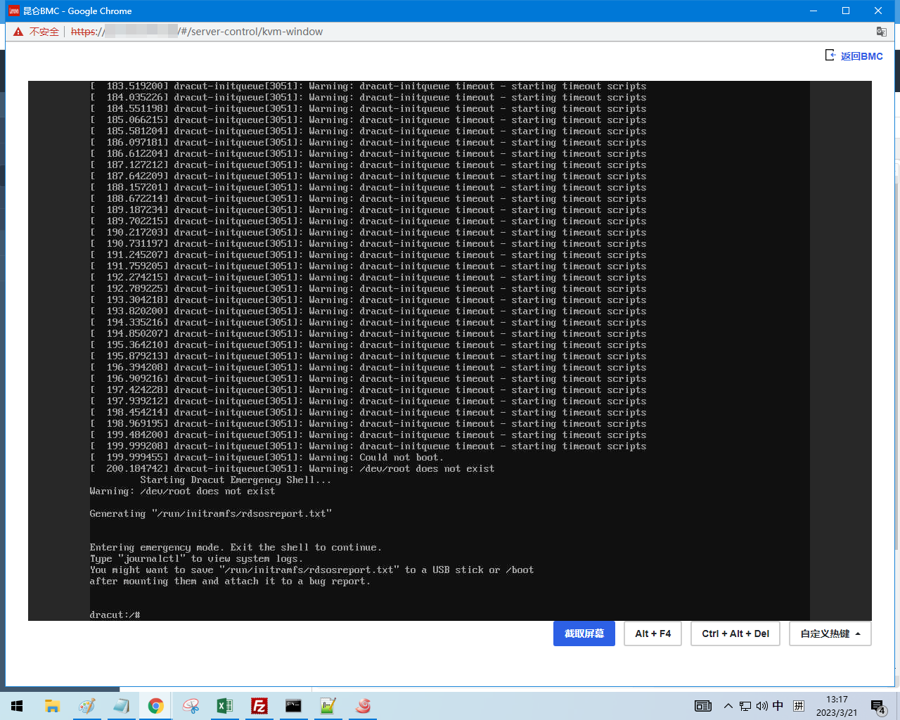
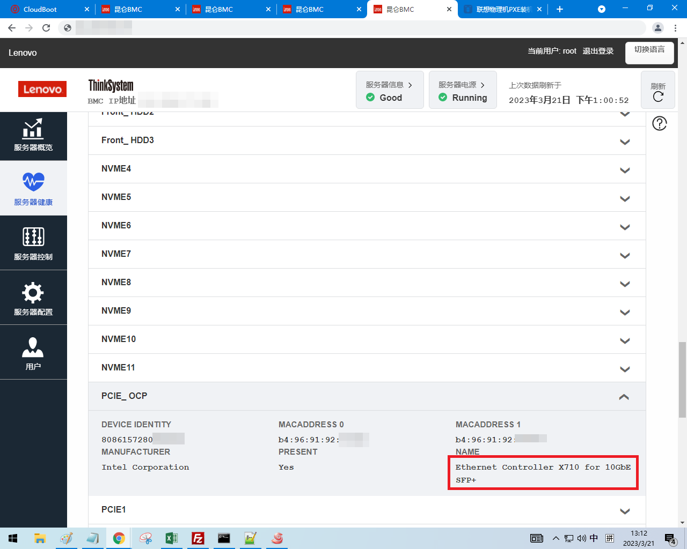

---
tags:
  - 中标麒麟
  - Linux
---

# 联想物理机 PXE 装机报错“根分区找不到”原因及解决方法

## PXE 装机启动过程

实际观察到的联想服务器装机启动过程大致如下：

1. 加载位于  [http://osinstall/kylin/v7-hygon/os/x86_64/images/pxeboot/vmlinuz](http://osinstall/kylin/v7-hygon/os/x86_64/images/pxeboot/vmlinuz) 的内核和位于 [http://osinstall/kylin/v7-hygon/os/x86_64/images/pxeboot/initrd.img](http://osinstall/kylin/v7-hygon/os/x86_64/images/pxeboot/vmlinuz%E7%9A%84%E5%86%85%E6%A0%B8%E5%92%8C%E4%BD%8D%E4%BA%8Ehttp://osinstall/kylin/v7-hygon/os/x86_64/images/pxeboot/initrd.img "http://osinstall/kylin/v7-hygon/os/x86_64/images/pxeboot/vmlinuz%E7%9A%84%E5%86%85%E6%A0%B8%E5%92%8C%E4%BD%8D%E4%BA%8Ehttp://osinstall/kylin/v7-hygon/os/x86_64/images/pxeboot/initrd.img")  的 initramfs
2. initramfs 加载完毕后，加载  [http://osinstall.pxe/kylin/v7-hygon/os/x86_64/LiveOS/squashfs.img](http://osinstall.pxe/kylin/v7-hygon/os/x86_64/LiveOS/squashfs.img "http://osinstall.pxe/kylin/v7-hygon/os/x86_64/LiveOS/squashfs.img") ，并将其挂载，之后 chroot 进 squashfs 进行后续安装

装机失败报错 /dev/root 找不到，是卡在挂载 squashfs.img 这一步：



用 ip a 命令检查发现没有网卡：


经过检查，装机失败的机器网卡为网讯 RP2000，驱动的内核模块应该是 txgbe ：


装机成功的机器网卡英特尔 X710，英特尔网卡兼容性好，initramfs 有驱动：



找不到 /dev/root 的原因为 initramfs 无 txgbe 网卡驱动，导致无法连接网络获取 squashfs.img ，最终导致 squashfs.img 无法挂载，安装镜像无法继续启动。

## 解决方法

!!! info

    以下过程需要用 root 用户操作

联想服务器 PXE 装机失败报错/dev/root 找不到，原因为 initrd.img 无法下载 squashfs.img，从而无法挂载 squashfs，经检查发现 initrd.img 里没有网讯网卡驱动，解决方法是在 initramfs 里加入网讯网卡驱动。首先将装机镜像的 images/pxeboot/initrd.img 复制到一台已经装好海光版本麒麟 7.6 的机器上（可以是没有网讯网卡的虚拟机），并解压 initrd.img：

```
mkdir /root/initramfs-hygon
cd /root/initramfs-hygon
xz -d -c -k /tmp/initrd.img | cpio -i
```

之后把驱动程序 txgbe.ko 使用 xz 压缩，并复制到相应目录：

```
cd usr/lib/modules/3.10.0-957.el7.hg.3.x86_64/kernel/drivers/net/ethernet/
mkdir txgbe
cd txgbe/
mv /tmp/txgbe.ko.xz .
```

然后需要 chroot 进去进行 depmod：

```
chroot /root/initramfs-hygon/
depmod -v | grep txgbe
```

```
/lib/modules/3.10.0-957.el7.hg.3.x86_64/kernel/drivers/net/ethernet/txgbe/txgbe.ko.xz needs "ptp_clock_index": /lib/modules/3.10.0-957.el7.hg.3.x86_64/kernel/drivers/ptp/ptp.ko.xz
```

退出 chroot ：

```
exit
```

之后重新封装 initrd.img：

```
cd /root/initramfs-hygon/
find . | cpio -H newc -o | xz --check=crc32 --x86 --lzma2 > /root/initrd-230322.img
```

验证：

```
lsinitramfs initrd-230322.img | grep txgbe
```

```
usr/lib/modules/3.10.0-957.el7.hg.3.x86_64/kernel/drivers/net/ethernet/txgbe
usr/lib/modules/3.10.0-957.el7.hg.3.x86_64/kernel/drivers/net/ethernet/txgbe/txgbe.ko.xz
```

最后把 initrd.img 替换，重新封装 ISO 镜像。
