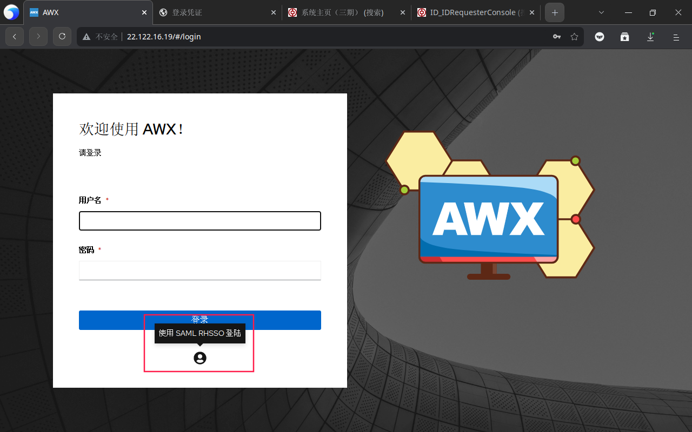

---
tags:
  - Keycloak
  - AWX
---

## 生成 SSL 证书

在任意 Linux 执行以下命令生成 SSL 证书：

```
openssl req -new -x509 -days 3650 -nodes -out saml_3650.crt -keyout saml_3650.key
```

这个命令提示一路回车不用管，SSL 证书直接申请 10 年。输出如下：

```
Generating a RSA private key
........+++++
....................................+++++
writing new private key to 'saml_3650.key'
-----
You are about to be asked to enter information that will be incorporated
into your certificate request.
What you are about to enter is what is called a Distinguished Name or a DN.
There are quite a few fields but you can leave some blank
For some fields there will be a default value,
If you enter '.', the field will be left blank.
-----
Country Name (2 letter code) [AU]:
State or Province Name (full name) [Some-State]:
Locality Name (eg, city) []:
Organization Name (eg, company) [Internet Widgits Pty Ltd]:
Organizational Unit Name (eg, section) []:
Common Name (e.g. server FQDN or YOUR name) []:
Email Address []:

```

## 修改 AWX 配置

点击 Settings -> Miscellaneous System ，修改“Base URL of the service”为 AWX 的公网 URL：


## 在 AWX 上配置 SAML 认证

点击 Settings -> SAML settings ，填写 keycloak 服务器配置如下：

1. SAML Service Provider Entity ID ： awx-saml
2. SAML Service Provider Public Certificate ：上传生成的 saml_3650.crt 证书
3. SAML Service Provider Private Key ：上传生成的 saml_3650.key 密钥
4. SAML Service Provider Organization Info ：

```
{
  "en-US": {
    "displayname": "RHSSO",
    "name": "RHSSO",
    "url": "https://sso.bocsys.cn"
  }
}
```

5. SAML Service Provider Technical Contact ：

```
{
  "emailAddress": "awx@boc.cn",
  "givenName": "boc"
}
```

6. SAML Service Provider Support Contact ：

```
{
  "emailAddress": "awx@boc.cn",
  "givenName": "boc"
}
```

7. SAML Enabled Identity Providers ：

```
{
  "RHSSO": {
    "attr_email": "email",
    "attr_first_name": "first_name",
    "attr_last_name": "last_name",
    "attr_user_permanent_id": "name_id",
    "attr_username": "username",
    "entity_id": "https://sso.bocsys.cn/auth/realms/BOC-IT",
    "url": "https://sso.bocsys.cn/auth/realms/BOC-IT/protocol/saml",
    "x509cert": "-----BEGIN CERTIFICATE-----MIIDaz*****X7Z-----END CERTIFICATE-----"
  }
}
```

x509cert 内容这样生成：

```bash
sed ':a;N;$!ba;s/\n//g' saml_3650.crt
```

8. SAML Organization Map ：

```
{
  "Default": {
    "users": true
  },
  "RHSSO": {
    "admins": [],
    "remove_admins": false,
    "remove_users": false,
    "users": true
  }
}
```

9. SAML Security Config 、 SAML Organization Attribute Mapping 、 SAML Team Attribute Mapping 、 SAML User Flags Attribute Mapping 均为 `{}`
10. SAML Service Provider extra configuration data 、 SAML IDP to extra_data attribute mapping 、 SAML Team Map 均为 `null`

## Keycloak 配置

接下来以 Keycloak 11 为例，Keycloak 24 不一样的地方特殊说明。首先需要在 AWX 上访问这里的 URL，获取 keycloak 配置：


下载 xml 配置，点击 keycloak 的 Clients -> Create , 上传 xml 配置：

如果是 Keycloak 高版本，需要把 Client signature required 关掉。之后修改成以下设置（实际测试 Keycloak 24 不需要修改）：

之后点击这里，点击“rsa”，上传 saml_3650.crt 和 saml_3650.key ：

在 Users 里建立 awx 用户：

点击这里新增 Mappers （Keycloak 24 为侧边栏 Client scopes -> role_list -> Mappers）：


之后还需要点开这里的 Single Role Attribute ：

完成以后，去 AWX 点击这里登录：

测试用户名、电子邮箱、姓名能否正常获取：


## 参考文献

https://dev.to/rpelisse/automate-your-sso-with-ansible-and-keycloak-o1k
https://docs.ansible.com/ansible-tower/latest/html/administration/ent_auth.html#saml-authentication-settings
https://github.com/ansible/awx/issues/5570
https://github.com/ansible/awx/issues/1016
https://github.com/ansible/awx/issues/4814
https://github.com/ansible/awx/issues/13226
https://www.ansible.com/blog/red-hat-single-sign-on-integration-with-ansible-tower
https://dev.to/iderr/connect-your-awxansible-tower-with-keycloak-using-oidc--4ekb
https://josh-tracy.github.io/Ansible_Tower_RedHatSSO/
https://github.com/getsentry/self-hosted/issues/1571
https://rdeplatform.netlify.app/docs/single%20sign-on%20with%20keycloak/integration%20with%20awx/
https://number1.co.za/using-keycloak-as-the-identity-provider-for-awx/
https://docs.ansible.com/ansible-tower/latest/html/administration/social_auth.html
