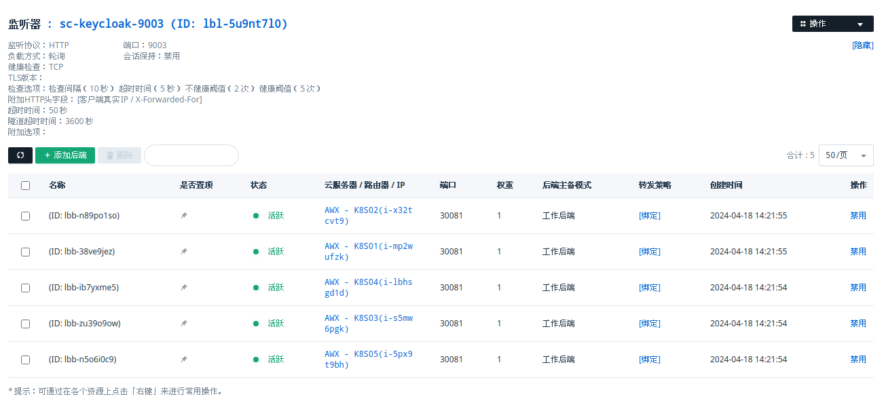

## 部署 MySQL 数据库

新建一套 MySQL-8 数据库，新建用户 keycloak 和数据库 keycloak，然后测试其连接性：

```bash
mysql -h'192.168.100.243' -P'3306' -ukeycloak -p keycloak
```

## 生成 SSL 证书

即使不使用，也需要自签证书，否则 Keycloak 无法以生成模式启动：

```bash
openssl req -subj '/CN=test.keycloak.org/O=Test Keycloak./C=US' -newkey rsa:2048 -nodes -keyout key.pem -x509 -days 3650 -out certificate.pem
```

## 部署 Keycloak

先创建 service，暴露服务端口 30081：

```yaml
---
apiVersion: v1
kind: Service
metadata:
  name: keycloak
  namespace: keycloak
  labels:
    app: keycloak
spec:
  type: NodePort
  ports:
    - name: http
      port: 8080
      targetPort: 8080
      nodePort: 30081
  selector:
    app: keycloak
  type: LoadBalancer
```

在默认情况下，keycloak 不同容器之间的互相发现是靠 IP multicast 广播实现，但是由于在 k8s 环境下，calico 和 fannel 不支持 multicast，不同 k8s 节点的 keycloak 容器广播不可达，就无法通过 multicast 发现彼此。默认的 multicast 服务发现方式在 calico 和 fannel 下不可使用，就需要自己写配置`cache-ispn.xml`替换容器里的来实现 keycloak 使用 JDBC ping 来发现彼此，这里直接把配置写 configmap 然后挂载到容器：

```yaml
---
apiVersion: v1
kind: ConfigMap
metadata:
  name: cache-ispn
  namespace: keycloak
data:
  cache-ispn.xml: |
    <?xml version="1.0" encoding="UTF-8"?>
    <!--
      ~ Copyright 2019 Red Hat, Inc. and/or its affiliates
      ~ and other contributors as indicated by the @author tags.
      ~
      ~ Licensed under the Apache License, Version 2.0 (the "License");
      ~ you may not use this file except in compliance with the License.
      ~ You may obtain a copy of the License at
      ~
      ~ http://www.apache.org/licenses/LICENSE-2.0
      ~
      ~ Unless required by applicable law or agreed to in writing, software
      ~ distributed under the License is distributed on an "AS IS" BASIS,
      ~ WITHOUT WARRANTIES OR CONDITIONS OF ANY KIND, either express or implied.
      ~ See the License for the specific language governing permissions and
      ~ limitations under the License.
      -->

    <infinispan
            xmlns:xsi="http://www.w3.org/2001/XMLSchema-instance"
            xsi:schemaLocation="urn:infinispan:config:14.0 http://www.infinispan.org/schemas/infinispan-config-14.0.xsd"
            xmlns="urn:infinispan:config:14.0">
        <jgroups>
            <stack name="jdbc-ping-tcp" extends="tcp">
                <JDBC_PING connection_driver="com.mysql.cj.jdbc.Driver"
                        connection_username="${env.KC_DB_USERNAME}"
                        connection_password="${env.KC_DB_PASSWORD}"
                        connection_url="${env.KC_DB_URL}"
                        info_writer_sleep_time="500"
                        initialize_sql="CREATE TABLE IF NOT EXISTS JGROUPSPING (own_addr varchar(200) NOT NULL, cluster_name varchar(200) NOT NULL, ping_data VARBINARY(255), constraint PK_JGROUPSPING PRIMARY KEY (own_addr, cluster_name));"
                        remove_all_data_on_view_change="true"
                        stack.combine="REPLACE"
                        stack.position="MPING" />
            </stack>
        </jgroups>
        <cache-container name="keycloak">
            <transport lock-timeout="60000" stack="jdbc-ping-tcp"/>
            <metrics names-as-tags="true" />
            <local-cache name="realms">
                <encoding>
                    <key media-type="application/x-java-object"/>
                    <value media-type="application/x-java-object"/>
                </encoding>
                <memory max-count="10000"/>
            </local-cache>
            <local-cache name="users">
                <encoding>
                    <key media-type="application/x-java-object"/>
                    <value media-type="application/x-java-object"/>
                </encoding>
                <memory max-count="10000"/>
            </local-cache>
            <distributed-cache name="sessions" owners="2">
                <expiration lifespan="-1"/>
            </distributed-cache>
            <distributed-cache name="authenticationSessions" owners="2">
                <expiration lifespan="-1"/>
            </distributed-cache>
            <distributed-cache name="offlineSessions" owners="2">
                <expiration lifespan="-1"/>
            </distributed-cache>
            <distributed-cache name="clientSessions" owners="2">
                <expiration lifespan="-1"/>
            </distributed-cache>
            <distributed-cache name="offlineClientSessions" owners="2">
                <expiration lifespan="-1"/>
            </distributed-cache>
            <distributed-cache name="loginFailures" owners="2">
                <expiration lifespan="-1"/>
            </distributed-cache>
            <local-cache name="authorization">
                <encoding>
                    <key media-type="application/x-java-object"/>
                    <value media-type="application/x-java-object"/>
                </encoding>
                <memory max-count="10000"/>
            </local-cache>
            <replicated-cache name="work">
                <expiration lifespan="-1"/>
            </replicated-cache>
            <local-cache name="keys">
                <encoding>
                    <key media-type="application/x-java-object"/>
                    <value media-type="application/x-java-object"/>
                </encoding>
                <expiration max-idle="3600000"/>
                <memory max-count="1000"/>
            </local-cache>
            <distributed-cache name="actionTokens" owners="2">
                <encoding>
                    <key media-type="application/x-java-object"/>
                    <value media-type="application/x-java-object"/>
                </encoding>
                <expiration max-idle="-1" lifespan="-1" interval="300000"/>
                <memory max-count="-1"/>
            </distributed-cache>
        </cache-container>
    </infinispan>
```

再创建 deployment：

```yaml
---
apiVersion: apps/v1
kind: Deployment
metadata:
  name: keycloak
  namespace: keycloak
  labels:
    app: keycloak
spec:
  replicas: 3
  selector:
    matchLabels:
      app: keycloak
  template:
    metadata:
      labels:
        app: keycloak
    spec:
      containers:
        - name: keycloak
          image: 192.168.100.12:8082/keycloak/keycloak:24.0
          args: ["start", "--hostname-strict-https=false"]
          env:
            - name: KEYCLOAK_ADMIN
              value: "admin"
            - name: KEYCLOAK_ADMIN_PASSWORD
              value: "**************"
            - name: KC_PROXY
              value: "edge"
            - name: KC_HTTP_ENABLED
              value: "true"
            - name: KC_HTTPS_CERTIFICATE_FILE
              value: "/etc/keycloak/ssl/tls.crt"
            - name: KC_HTTPS_CERTIFICATE_KEY_FILE
              value: "/etc/keycloak/ssl/tls.key"
            - name: KC_HOSTNAME_STRICT
              value: "false"
            - name: KC_HOSTNAME
              value: "22.122.16.19"
            - name: KC_HOSTNAME_PORT
              value: "9003"
            - name: KC_DB
              value: mysql
            - name: KC_DB_USERNAME
              value: keycloak
            - name: KC_DB_PASSWORD
              value: '********'
            - name: KC_DB_URL_HOST
              value: 192.168.100.243
            - name: KC_DB_URL_PORT
              value: "3306"
            - name: KC_DB_URL_DATABASE
              value: keycloak
            - name: KC_DB_URL
              value: "jdbc:mysql://192.168.100.243:3306/keycloak"
            - name: KC_CACHE_CONFIG_FILE
              value: cache-ispn.xml
          ports:
            - name: http
              containerPort: 8080
          ports:
            - name: discovery
              containerPort: 7600
          volumeMounts:
            - mountPath: "/etc/keycloak/ssl/"
              name: keycloak-ssl
              readOnly: true
            - name: cache-ispn
              mountPath: /opt/keycloak/conf/cache-ispn.xml
              subPath: cache-ispn.xml
          readinessProbe:
            httpGet:
              path: /realms/master
              port: 8080
      imagePullSecrets:
        - name: nexus-regcred
      volumes:
        - name: keycloak-ssl
          secret:
            secretName: keycloak-tls-secret
        - name: cache-ispn
          configMap:
            defaultMode: 0755
            name: cache-ispn
            items:
            - key: cache-ispn.xml
              path: cache-ispn.xml
```

JDBC ping 的原理是每个 keycloak 都往数据库里的 JGROUPSPING 表写上自己的信息，通过读数据库来发现别的节点。在创建完成以后，需要进入到容器里，修改 admin realm 的 sslRequired 参数：

```bash
kubectl -n keycloak exec -it keycloak-8659669957-jrtqr -- /bin/bash
/opt/keycloak/bin/kcadm.sh update realms/master -s sslRequired=NONE --server http://keycloak:8080 --realm master --user admin
```

### 配置负载均衡器

负载均衡器配置如下，需要打开“附加 HTTP 头字段：\[客户端真实 IP / X-Forwarded-For\]”功能：


## 参考链接

<https://github.com/keycloak/keycloak-quickstarts/blob/release/24.0/kubernetes/keycloak.yaml>
<https://www.keycloak.org/server/db#_supported_databases>
<https://www.keycloak.org/server/hostname>
<https://www.keycloak.org/operator/basic-deployment>
<https://faun.pub/mount-ssl-certificates-in-kubernetes-pod-with-secret-8aca220896e6>
<https://www.keycloak.org/operator/advanced-configuration>
<https://www.keycloak.org/server/all-config>
<https://www.keycloak.org/operator/basic-deployment>
<https://www.keycloak.org/operator/installation>
<https://www.keycloak.org/2019/05/keycloak-cluster-setup>
<https://jbjerksetmyr.medium.com/how-to-setup-a-keycloak-server-with-external-mysql-database-on-aws-ecs-fargate-in-clustered-mode-edf664a765bf>
