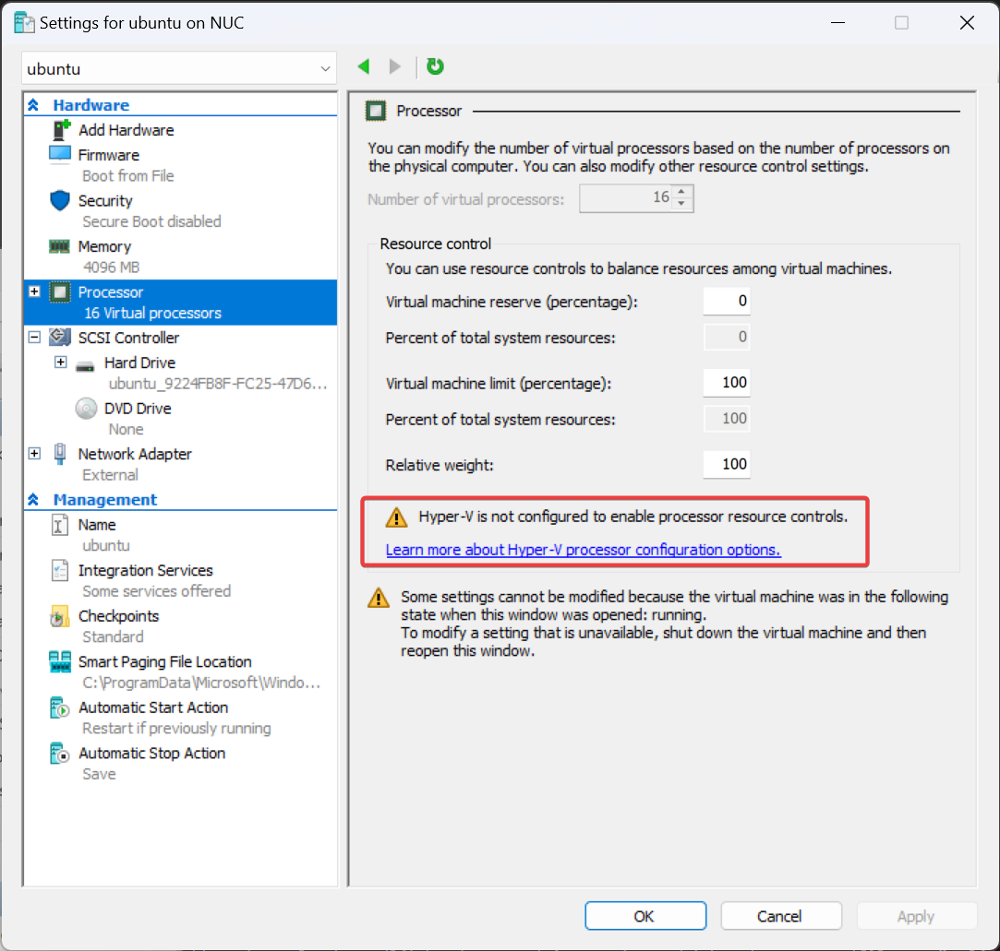

---
tags:
  - Hyper-V
---

# Hyper-V 修改调度器

在尝试给 Hyper-V 虚拟机设置 CPU 使用限制时，发现这样的告警：



需要修改调度器。查看当前调度器的 PowerShell 命令为：

```powershell
Get-WinEvent -FilterHashTable @{ProviderName="Microsoft-Windows-Hyper-V-Hypervisor"; ID=2} -MaxEvents 1
```

命令返回如下：

```
   ProviderName: Microsoft-Windows-Hyper-V-Hypervisor


TimeCreated                      Id LevelDisplayName Message
-----------                      -- ---------------- -------
6/1/2024 9:31:43 PM               2 Information      Hypervisor scheduler type is 0x4.
```

其中 `0x4` 表示调度器为 `Root scheduler` ，其它数字含义如下：

- 1 = Classic scheduler, SMT disabled
- 2 = Classic scheduler
- 3 = Core scheduler
- 4 = Root scheduler

调度器具体区别可参考 [Manage Hyper-V hypervisor scheduler types](https://learn.microsoft.com/en-us/windows-server/virtualization/hyper-v/manage/manage-hyper-v-scheduler-types) ，

修改调度器方法为 Core scheduler 的方法为：

```
bcdedit /set hypervisorschedulertype core
```

修改以后需要重启。
