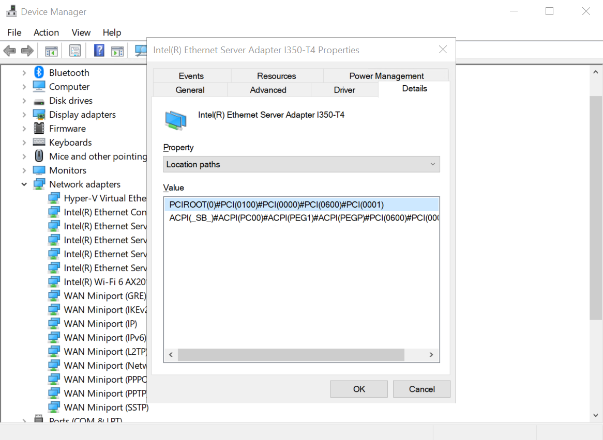
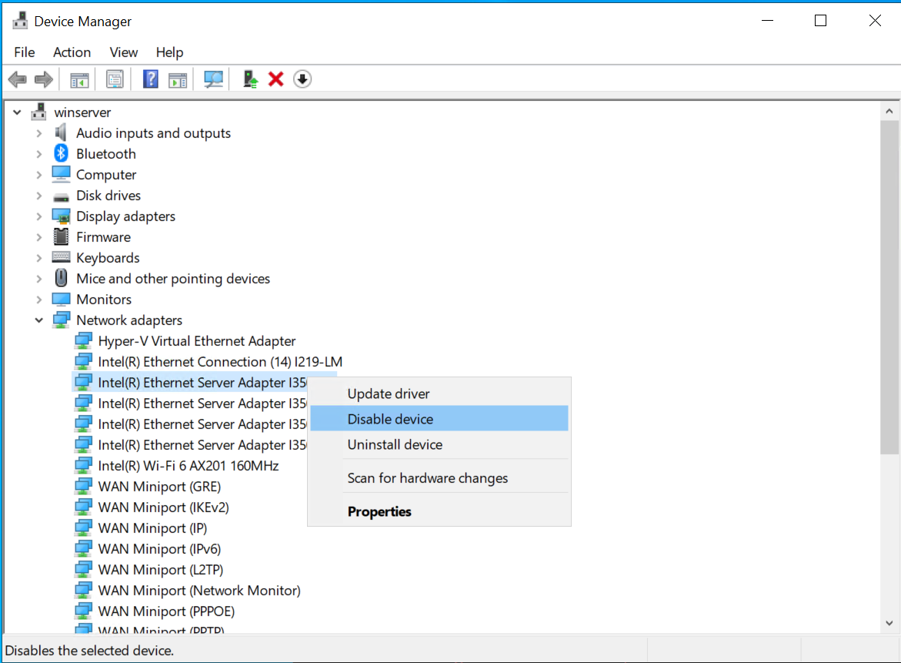

# Hyper-V 网卡直通

## 宿主机禁用网卡

进入设备管理器，先找到网卡的 LocationPath ：



将其记录下来后，设备管理器中禁用设备：



之后将设备从宿主机上解除挂载：

```powershell
Dismount-VMHostAssignableDevice -LocationPath "PCIROOT(0)#PCI(0100)#PCI(0000)#PCI(0600)#PCI(0001)" -Force
```

如果需要将网卡加回宿主机：

```powershell
Mount-VMHostAssignableDevice -LocationPath "PCIROOT(0)#PCI(0100)#PCI(0000)#PCI(0600)#PCI(0001)"
```

如果查看已经解除挂载但未分配给虚拟机的设备：

```powershell
Get-VMHostAssignableDevice
```

## 将设备挂载到虚拟机

将上述设备加入到虚拟机 `speedtest` 的命令为：

```powershell
Add-VMAssignableDevice -VMName speedtest -LocationPath "PCIROOT(0)#PCI(0100)#PCI(0000)#PCI(0600)#PCI(0001)"
```

如果需要移除此设备：

```powershell
Remove-VMAssignableDevice -VMName speedtest -LocationPath "PCIROOT(0)#PCI(0100)#PCI(0000)#PCI(0600)#PCI(0001)"
```

查看所有已连接设备：

```powershell
Get-VMAssignableDevice -VMName speedtest
```

## 参考资料

<https://www.nakivo.com/blog/hyper-v-gpu-passthrough/>
