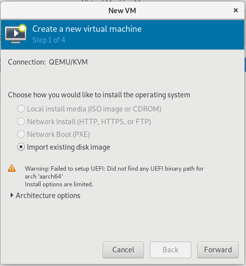

---
tags:
  - QEMU
  - KVM
  - 银河麒麟V10
---

# virt-manager 创建虚拟机报错 “Did not find any UEFI binary path for arch 'aarch64'” 问题

## 问题描述

在 ARM64 架构的华为鲲鹏架构物理机上，安装 virt-manager 后，无法创建 KVM 虚拟机，报错 “Did not find any UEFI binary path for arch 'aarch64'” ：



操作系统为银河麒麟 V10，经过检查， `edk2-ovmf-201908-9.ky10.noarch.rpm` 软件包已安装。

## 解决方法

需要安装 `edk2-aarch64` 并重启 libvirtd ：

```
yum install edk2-aarch64
systemctl restart libvirtd
```
