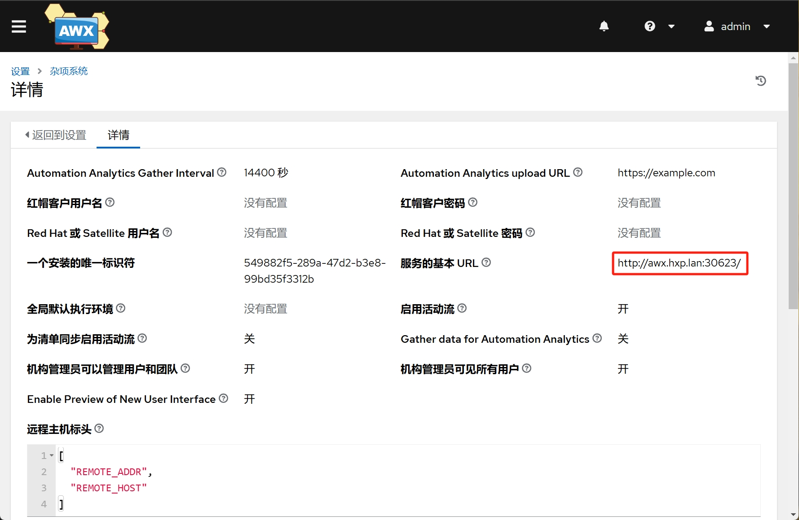
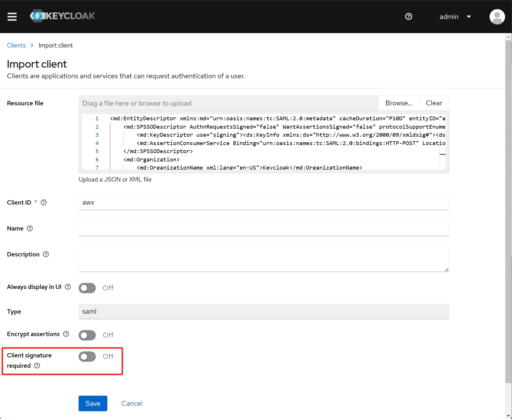
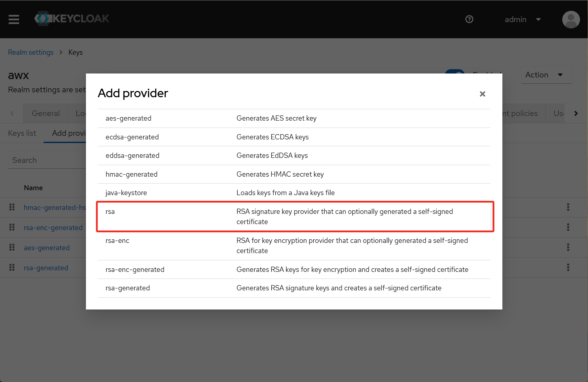
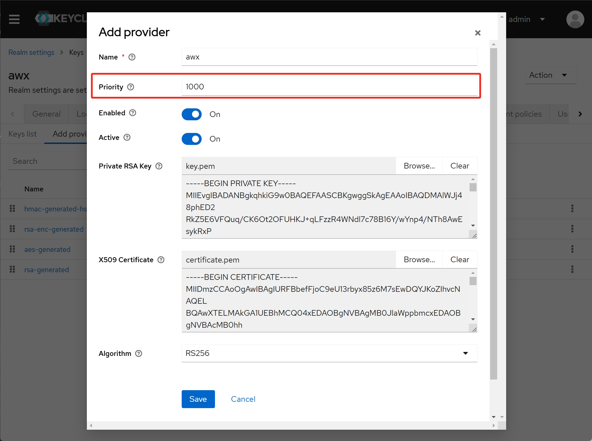
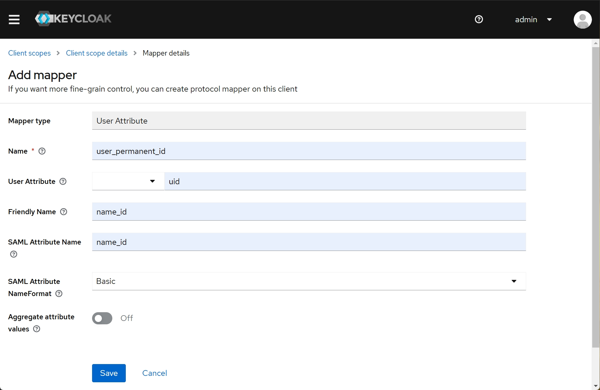
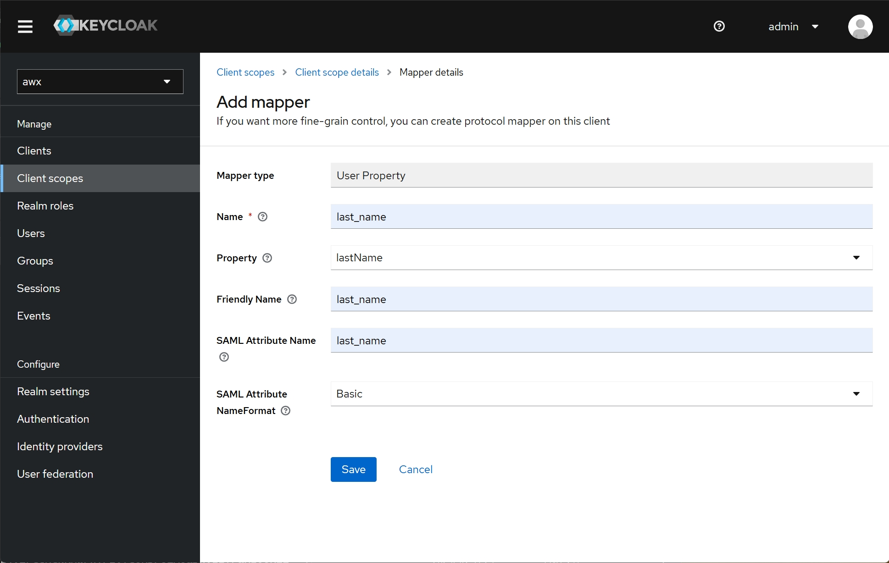
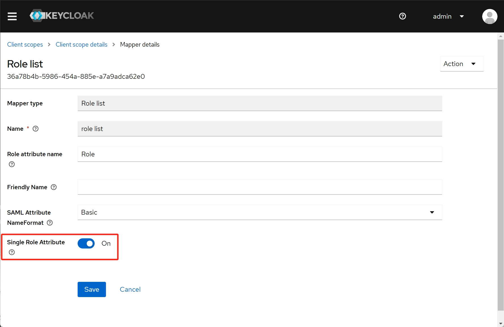
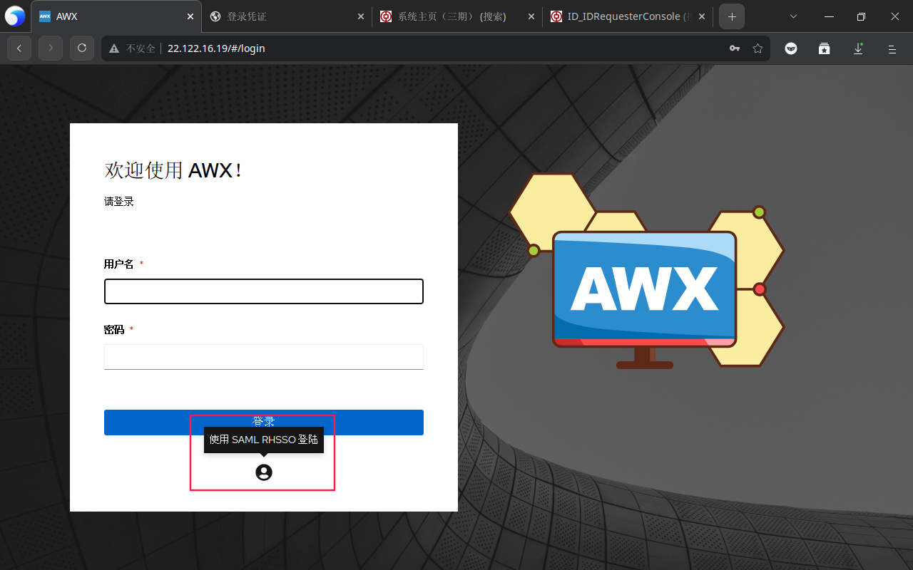
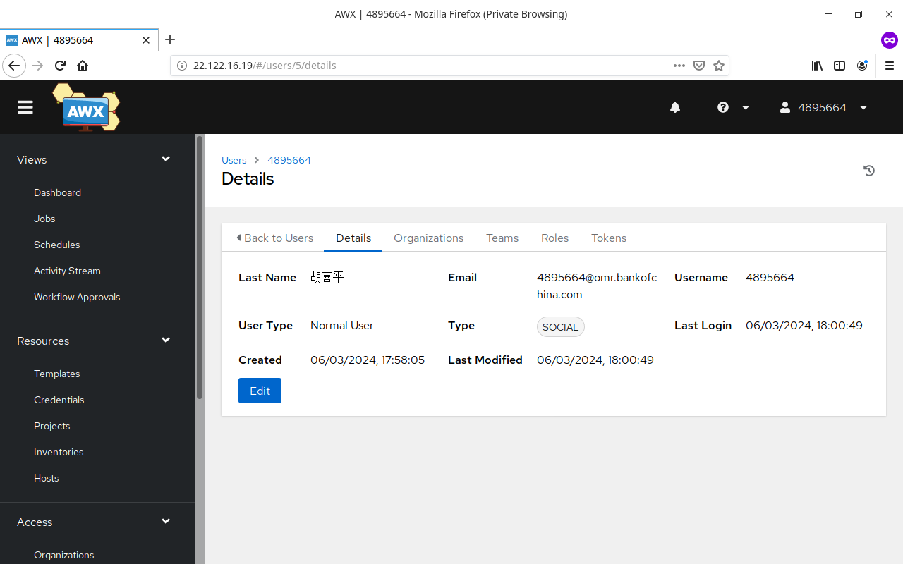

---
tags:
  - Keycloak
  - AWX
---

# AWX-23.9 使用 SAML 对接 Keycloak-24 认证

## 生成 SSL 证书

在任意 Linux 执行以下命令生成 SSL 证书：

```bash
openssl req -subj "/C=CN/ST=Beijing/L=Haidian/O=awx.hxp.lan/CN=awx.hxp.lan" -sha256 -newkey rsa:2048 -nodes -keyout key.pem -x509 -days 3650 -out certificate.pem
```

此 SSL 证书直接申请了 10 年有效期。记得在 10 年后更新。

## 修改 AWX 配置

点击 `设置` -> `杂项系统` ，修改 `服务的基本 URL` 为 AWX 的公网 URL：



## 在 AWX 上配置 SAML 认证

点击 `设置` -> `SAML` ，填写 Keycloak SAML 服务器配置：

### SAML 服务提供商实体 ID

填写 `awx-saml`

### SAML 服务提供商公共证书

上传生成的证书 `certificate.pem`

### SAML 服务提供商私钥

上传生成的密钥 `key.pem`

### SAML 服务提供商机构信息

填写以下内容：

```json
{
  "en-US": {
    "displayname": "Keycloak",
    "name": "Keycloak",
    "url": "http://keycloak.hxp.lan:30081/"
  }
}
```

### SAML 服务提供商技术联系人

填写以下内容：

```json
{
  "emailAddress": "awx@example.com",
  "givenName": "awx"
}
```

### SAML 服务提供商支持联系人

填写以下内容：

```json
{
  "emailAddress": "awx@example.com",
  "givenName": "awx"
}
```

### SAML 启用的身份提供商

填写以下内容：

```json
{
  "Keycloak": {
    "attr_email": "email",
    "attr_first_name": "first_name",
    "attr_last_name": "last_name",
    "attr_user_permanent_id": "name_id",
    "attr_username": "username",
    "entity_id": "http://keycloak.hxp.lan:30081/realms/awx",
    "url": "http://keycloak.hxp.lan:30081/realms/awx/protocol/saml",
    "x509cert": "-----BEGIN CERTIFICATE-----MIIDaz*****X7Z-----END CERTIFICATE-----"
  }
}
```

x509cert 内容这样生成：

```bash
sed ':a;N;$!ba;s/\n//g' certificate.pem | sed 's/^-----BEGIN CERTIFICATE-----//;s/-----END CERTIFICATE-----$//'
```

### SAML 机构映射

```json
{
  "Default": {
    "users": true
  },
  "Keycloak": {
    "admins": [],
    "remove_admins": false,
    "remove_users": false,
    "users": true
  }
}
```

### SAML 机构属性映射

默认值

### SAML 团队映射

默认值

### SAML 团队属性映射

默认值

### SAML User Flags Attribute Mapping

默认值

### SAML 安全配置

默认值

### SAML 服务提供商额外配置数据

默认值

### SAML IDP 到 extra_data 属性映射

默认值

## 获取 SAML 配置并导入 Keycloak

在 AWX 上完成 SAML 配置后，配置页面上 `SAML 服务提供商元数据 URL` 可下载 SAML 配置，下载此配置后，在 Keycloak 上新建 Realm 名称 awx ，点击 `Clients` -> `Import client` 将此配置导入：



导入配置时需要将 `Client signature required` 关闭。

## Keycloak 导入证书

自签的 SSL 证书需要导入到 Keycloak ，点击 `Realm Settings` -> `Keys` -> `Add provider` 添加类型为 `rsa` 的密钥：



选择证书和密钥并保存：



注意这里的优先级必须足够大。

## Keycloak 配置用户信息映射

进入 `Client scopes` -> `role_list` -> `Mappers` -> `Add mapper` -> `By configuration` ，创建如下 `User Attribute` 映射：



创建如下 `User Property` 映射：




进入 `Client scopes` -> `role_list` -> `Mappers` -> `role list` ，开启 `Single Role Attribute` 选项：



完成以后，去 AWX 点击这里登录：

测试用户名、电子邮箱、姓名能否正常获取：


## 参考文献

https://dev.to/rpelisse/automate-your-sso-with-ansible-and-keycloak-o1k

https://docs.ansible.com/ansible-tower/latest/html/administration/ent_auth.html#saml-authentication-settings

https://github.com/ansible/awx/issues/5570

https://github.com/ansible/awx/issues/1016

https://github.com/ansible/awx/issues/4814

https://github.com/ansible/awx/issues/13226

https://www.ansible.com/blog/red-hat-single-sign-on-integration-with-ansible-tower

https://dev.to/iderr/connect-your-awxansible-tower-with-keycloak-using-oidc--4ekb

https://josh-tracy.github.io/Ansible_Tower_RedHatSSO/

https://github.com/getsentry/self-hosted/issues/1571

https://rdeplatform.netlify.app/docs/single%20sign-on%20with%20keycloak/
integration%20with%20awx/

https://number1.co.za/using-keycloak-as-the-identity-provider-for-awx/

https://docs.ansible.com/ansible-tower/latest/html/administration/social_auth.html
