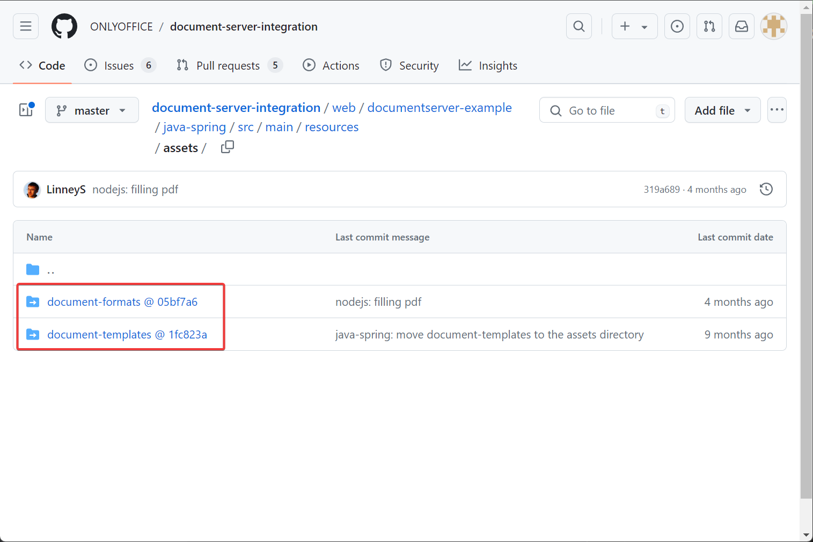
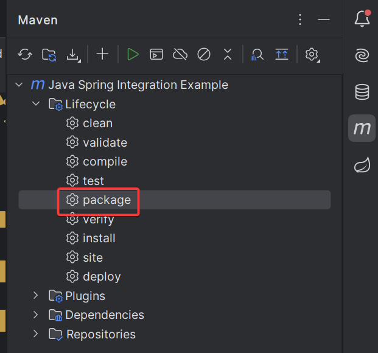

---
tags:
  - OnlyOffice
  - SpringBoot
  - Maven
---

# 使用 OnlyOffice 官方 Spring 示例遇到的坑

## GitHub 下载下来的代码中 resources 目录缺失

这是由于 `web/documentserver-example/java-spring/src/main/resources` 下的两个目录不属于这个 GitHub 仓库，是 submodule ：



```
git clone --recurse-submodules https://github.com/ONLYOFFICE/document-server-integration.git
```

## 如何用 IDEA 将项目编译成 jar 包

项目加载到 IDEA 后，点开 maven 的标签页，鼠标双击这个 `package` ：



jar 包会生成在 `target/integration-1.0.jar` ，将其复制即可使用。

## 项目打包成 jar 后单独运行报错

项目打包成 jar 包单独运行会报错 FileNotFoundException ，原因有 2 个，首先是 resources 目录没有被打包进入 jar 包，解决方法为修改 `pom.xml` ，在 `build` 中加入：

```xml
<resources>
  <resource>
    <directory>${basedir}/src/main/resources</directory>
  </resource>
</resources>
```

其次是 `src/main/java/com/onlyoffice/integration/documentserver/util/service/DefaultFormatService.java` 中这一行使用的 `getFile()` 方法在 jar 包中不适用：

```java
File targetFile = resourceFile.getFile();
```

需要将这一行修改为以下几行：

```java
InputStream inputStream = resourceFile.getInputStream();
File targetFile = File.createTempFile("onlyoffice-docs-formats", ".json");
try (FileOutputStream outputStream = new FileOutputStream(targetFile)) {
    final int bufferLength = 1024;
    byte[] buffer = new byte[bufferLength];
    int bytesRead;
    while ((bytesRead = inputStream.read(buffer)) != -1) {
        outputStream.write(buffer, 0, bytesRead);
    }
}
```

同时需要导入额外的以下两个包：

```java
import java.io.FileOutputStream;
import java.io.InputStream;
```

## 文档上传大小限制修改

默认的文档上传限制过小，有些大文档上传会报错，需要修改 `src/main/resources/application.properties` ：

```ini
filesize-max=5242880
spring.servlet.multipart.max-file-size=50MB
spring.servlet.multipart.max-request-size=50MB
```

将以上三个参数修改为原来的 10 倍。

## 修改为使用 MySQL 数据库

默认情况下这个 Spring 示例使用在内存中的 h2 数据库，需要将其修改为使用 MySQL ，需要修改 `src/main/resources/application.properties` ，将以下几行：

```ini
spring.datasource.url=jdbc:h2:mem:usersdb
spring.datasource.driverClassName=org.h2.Driver
spring.datasource.username=sa
spring.datasource.password=password
spring.jpa.database-platform=org.hibernate.dialect.H2Dialect
hibernate.ddl-auto
```

修改为如下所示：

```ini
spring.datasource.url=jdbc:mysql://ubuntu.hxp.lan:3306/spring
spring.datasource.driverClassName=com.mysql.cj.jdbc.Driver
spring.datasource.username=spring
spring.datasource.password=spring
spring.jpa.hibernate.ddl-auto=create-drop
```

同时，在 `pom.xml` 里增加 mysql-connector ：

```xml
<dependency>
  <groupId>mysql</groupId>
  <artifactId>mysql-connector-java</artifactId>
</dependency>
```
